# 第三章 Java内存模型

## 3.1 Java内存模型的基础

### 3.1.1 并发编程模型的两个关键问题

#### 线程之间如何通信

##### 共享内存

线程之间共享程序的公共状态

##### 消息传递

没有公共状态 通过发送消息进行显式通信

#### 线程之间如何同步

同步是程序中用于控制不同线程间操作发生的相对顺序

Java采用共享内存的方式

### 3.1.2 Java内存模型的抽象结构

Java内存模型 JMM

线程之间的共享变量存在主存中,没有线程都有一个私有的本地内存,本地内存中存储了该线程以读/写共享变量的副本.

线程A 与 线程B 通信 步骤

线程A 把本地内存A中更新过的共享变量刷新到主内存中取

线程B 从 主内存中取读取线程A之前更新后的共享变量


### 3.1.3 从源代码到指令序列的重排序

三种重排序

1. 编译器优化的重排序: 程序在不改变**单线程程序语义**的前提下,可以重新安排语句的执行顺序
2. 指令级并行的重排序:如果不存在**数据依赖**,处理器可以改变语句对应机器指令的执行顺序
3. 内存系统的重排序:  由于处理器使用**缓存和读/写缓冲区**,这使得加载和存储操作看上去可能实在乱序执行

1属于编译器重排序  2和3属于处理器重排序

JMM 对于编译器:  JMM的编译器会根据重排序规则禁止特定类型的**编译器重排序**

JMM对于处理器:   JMM 要求要求Java编译器在生成指令序列时,***插入特定类型的内存屏障**指令,通过内存屏障指令来禁止某种特定类型的处理器重排序


通过上述两个方式  提供了一致的内存可见性保证

### 3.1.4 并发编程模型的分类

写缓冲区---> 允许对写--读操作进行重排序

内存屏障类型:

LoadLoad

LoadStore

StoreStore

StoreLoad: Store1 ;StoreLoad;Load2 确保Store1 数据对其他处理器变得可见(刷新到内存)

先于Load2 及所有后续装载指令的装载

### 3.1.5 happens-before 简介

在JMM中  如果一个操作的结果需要对另一个操作可见,那么这两个操作必须要存在happens-before 关系

相关规则如下:

程序顺序规则: 一个线程的每个操作,happens-before 于线程中的任意后续操作

监视器锁规则: 对一个锁的解锁,happens-before 于随后对这个锁的加锁

volatile变量规则: 对volatile变量的写,happens-before 于随后对这个变量的读

传递性: A hb B  且 B hb C  则  A hb C


注意:

两个操作之间存在happens-before 关系,并不意味着 前一个操作必须要在后一个操作之前执行!!!!!!!

happens-before 仅仅要求前一个操作(执行的结果) 对后一个操作可见,且前一个操作按顺序排在后一个操作之前


## 3.2 重排序

重排序是指 编译器和处理器为了优化程序性能而对指令序列进行重新排序的一种手段

### 3.2.1  数据依赖

如果两个操作访问同一个变量, 且其中一个操作为写操作,那么这两个操作就存在数据依赖性

分为三类

- [ ] |  名称  | 代码示例 |           说明            |
  | :----: | :------: | :-----------------------: |
  | 写后读 | a=1;b=a; | 写一个变量后,在读这个变量 |
  | 写后写 | a=1;a=2; | 写一个变量后,在写这个变量 |
  | 读后写 | b=a;a=1; | 读一个变量后,在写这个变量 |

对于存在数据依赖的操作,编译器和处理器不会对其进行重排序

### 3.2.2 as-is-serial

as-is-serial 不管怎样重排序,(单线程)程序的执行结果不会被改变


```java
double pi = 3.14; //A
double r = 1.0; //B
double area = pi * r * r //C
```

AC存在数据依赖 BC存在数据依赖 执行顺序可能为:

A-B-C

B-A-C

### 3.2.3  程序顺序规则

两个操作之间存在happens-before 关系,并不意味着 前一个操作必须要在后一个操作之前执行!!!!!!!

happens-before 仅仅要求前一个操作(执行的结果) 对后一个操作可见,且前一个操作按顺序排在后一个操作之前

```
happens-before A hb B  B hb C ---> A hb C
```

### 3.2.4 重排序对多线程的影响

```java
public class ReorderExample {
    int a = 0;
    boolean flag = false;

    /**
     * 操作1和2 无数据依赖 可能发生重排序
     */
    public void writer() {
        a = 1;       // 1
        flag = true; // 2
    }

    /**
     * 操作3和4 存在控制依赖关系 编译器和处理器采取 猜测 执行
     * 重排序缓冲
     */
    public void reader() {
        if (flag) {   // 3
            int i = a * a;// 4
            System.out.println(i);
        }
    }
}
```

当有两个线程A和B  ,A 先执行writer  B 后执行reader

操作1和2发生重排序

程序的执行顺序可能如下:

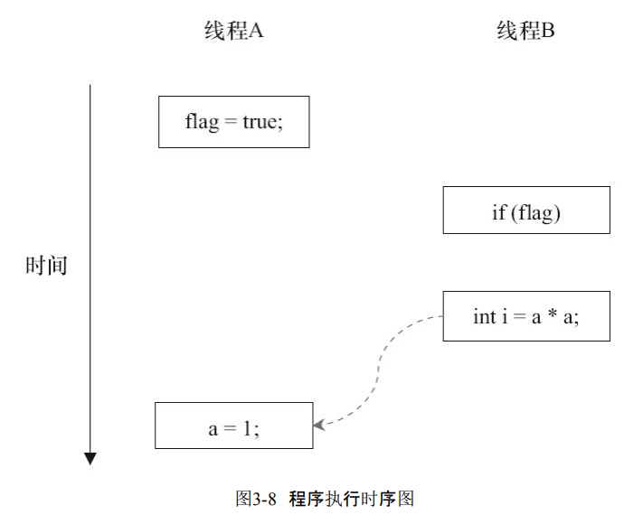

线程A 对于a的赋值 对于B来说 没有用到!!!!1


操作3和4发生重排序

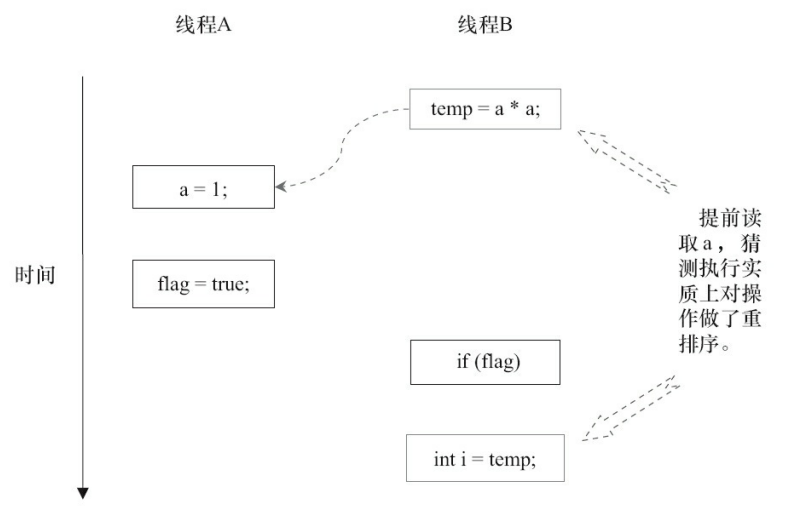

当代码中存在控制依赖性时，会影响指令序 列执行的并行度。为此，编译器和处理器会采用猜测（Speculation）执行来克服控制相关性对并 行度的影响。以处理器的猜测执行为例，执行线程B的处理器可以提前读取并计算a*a，然后把 计算结果临时保存到一个名为重排序缓冲（Reorder Buffer，ROB）的硬件缓存中。当操作3的条 件判断为真时，就把该计算结果写入变量i中。 从图中我们可以看出，猜测执行实质上对操作3和4做了重排序。重排序在这里破坏了 多线程程序的语义！


总结:

在单线程程序中，对存在控制依赖的操作重排序，不会改变执行结果（这也是as-if-serial 语义允许对存在控制依赖的操作做重排序的原因）；

但在多线程程序中，对存在**控制依赖**的操作重排序，可能会改变程序的执行结果


## 3.3 顺序一致性

顺序一致性内存模型是一个理论参考模型，在设计的时候，处理器的内存模型和编程语 言的内存模型都会以顺序一致性内存模型作为参照。

### 3.3.1 数据竞争和数据一致性

当程序未正确同步时,就可能发生数据竞争

JMM 对数据竞争的定义:

  在一个线程写入变量,

  在另一个线程读取同一个变量,

  而且写和读没有通过同步来排序

JMM对正确同步的多线程程序的内存一致性做了如下保证。

如果程序是正确同步的，程序的执行将具有顺序一致性（Sequentially Consistent）——即程序的执行结果与该程序在顺序一致性内存模型中的执行结果相同。

这里的同步是指广义上的同步，包括对常用同步原语 （synchronized、volatile和final）的正确使用

### 3.3.2 顺序一致性内存模型

顺序一致性内存模型是一个被计算机科学家**理想化了的理论参考模型**，它为程序员提供 了极强的**内存可见性**保证。顺序一致性内存模型有两大特性。

1）一个线程中的所有操作必须按照程序的顺序来执行。

 2）（不管程序是否同步）所有线程都只能看到一个单一的操作执行顺序。在顺序一致性内 存模型中，每个操作都必须原子执行且立刻对所有线程可见。

### 3.3.3 同步程序的顺序一致性效果

```java
class SynchronizedExample {
    int a = 0;
    boolean flag = false;

    public synchronized void writer() { // 获取锁
        a = 1;
        flag = true;
    } 									// 释放锁

    public synchronized void reader() { // 获取锁
        if (flag) {
            int i = a;

        } 								// 释放锁
    }
}

```

假设A线程执行writer()方法后，B线程执行reader()方法。

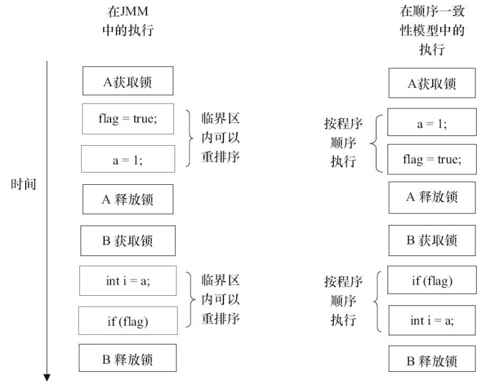

顺序一致性模型中，所有操作完全按程序的顺序串行执行。

而在JMM中，临界区内的代码 可以重排序（但JMM不允许临界区内的代码“逸出”到临界区之外，那样会破坏监视器的语 义）。

从这里可以看到，JMM在具体实现上的基本方针为：在不改变（正确同步的）程序执行结果的前提下，尽可能地为编译器和处理器的优化打开方便之门。

### 3.3.4 未同步程序的执行特性

对于未同步或未正确同步的多线程程序，JMM只提供最小安全性：线程执行时读取到的值，要么是之前某个线程写入的值，要么是默认值（0，Null，False），JMM保证线程读操作读取到的值不会无中生有Out Of Thin Air）的冒出来。

为了实现最小安全性，JVM在堆上分配对象 时，首先会对内存空间进行清零，然后才会在上面分配对象（JVM内部会同步这两个操作）。因 此，在已清零的内存空间（Pre-zeroed Memory）分配对象时，域的默认初始化已经完成了


未同步程序在JMM中的执行时，整体上是无序的，其执行结果无法预知。未同步程序在两 个模型中的执行特性有如下几个差异。 

1）顺序一致性模型保证单线程内的操作会按程序的顺序执行，而JMM不保证单线程内的操作会按程序的顺序执行（比如上面正确同步的多线程程序在临界区内的重排序）。

 2）顺序一致性模型保证所有线程只能看到一致的操作执行顺序，而JMM不保证所有线程 能看到一致的操作执行顺序。

 3）JMM不保证对64位的long型和double型变量的写操作具有原子性，而顺序一致性模型保 证对所有的内存读/写操作都具有原子性。


第3个差异与处理器总线的工作机制密切相关。

在计算机中，数据通过总线在处理器和内 存之间传递。每次处理器和内存之间的数据传递都是通过一系列步骤来完成的，这一系列步 骤称之为总线事务（Bus Transaction）。

总线事务包括读事务（Read Transaction）和写事务（Write Transaction）。

读事务从内存传送数据到处理器，写事务从处理器传送数据到内存

每个事务会 读/写内存中一个或多个物理上连续的字。这里的关键是，总线会同步试图并发使用总线的事 务。在一个处理器执行总线事务期间，总线会禁止其他的处理器和I/O设备执行内存的读/写。

在一些32位的处理器上，如果要求对64位数据的写操作具有原子性，会有比较大的开销。 

为了照顾这种处理器，Java语言规范鼓励但不强求JVM对64位的long型变量和double型变量的写操作具有原子性。当JVM在这种处理器上运行时，可能会把一个64位long/double型变量的写操作拆分为两个32位的写操作来执行。这两个32位的写操作可能会被分配到不同的总线事务 中执行，此时对这个64位变量的写操作将不具有原子性。


如上图所示，假设处理器A写一个long型变量，同时处理器B要读这个long型变量。处理器 A中64位的写操作被拆分为两个32位的写操作，且这两个32位的写操作被分配到不同的写事 务中执行。同时，处理器B中64位的读操作被分配到单个的读事务中执行。当处理器A和B按上 图的时序来执行时，处理器B将看到仅仅被处理器A“写了一半”的无效值

在JSR-133之前的旧内存模型中，一个64位long/double型变量的读/写操作可以被拆分为两个32位的读/写操作来执行。从JSR-133内存模型开始（即从JDK5开始），仅仅只允许把 一个64位long/double型变量的写操作拆分为两个32位的写操作来执行，任意的读操作在JSR133中都必须具有原子性（即任意读操作必须要在单个读事务中执行）。


## 3.4 volatile的内存语义

### 3.4.1 volatile的特性

理解volatile特性的一个好方法是把对volatile变量的单个读/写，看成是使用同一个锁对这 些单个读/写操作做了同步。下面通过具体的示例来说明，示例代码如下。


```java

package com.lk.concurrent.thread;

public class VolatileFeaturesExample {

    volatile long vl = 0L; // 使用volatile声明64位的long型变量

    public void set(long l) {
        vl = l; // 单个volatile变量的写
    }

    public void getAndIncrement() {
        vl++; // 复合（多个）volatile变量的读/写
    }

    public long get() {
        return vl; // 单个volatile变量的读
    }

}


class VolatileFeaturesExample2 {

    long vl = 0L; // 64位的long型普通变量

    public synchronized void set(long l) { // 对单个的普通变量的写用同一个锁同步
        vl = l;
    }

    public void getAndIncrement() { // 普通方法调用
        long temp = get(); // 调用已同步的读方法
        temp += 1L; // 普通写操作
        set(temp); // 调用已同步的写方法
    }

    public synchronized long get() { // 对单个的普通变量的读用同一个锁同步
        return vl;
    }


}


```

上述两个程序等价

一个volatile变量的单个读/写操作，与一个普通变量的读/写操作都是使用同一个锁来同步，它们之间的执行效果相同。


锁的语义决定了临界区代码的执行具有原子性。这意味着，即使是64位的long型和double 型变量，只要它是volatile变量，对该变量的读/写就具有原子性。

如果是多个volatile操作或类似于**volatile++**这种复合操作，这些操作**整体上不具有原子性**。

简而言之，volatile变量自身具有下列特性。 

> 可见性。对一个volatile变量的读，总是能看到（任意线程）对这个volatile变量最后的写入。
>
> 原子性：对任意**单个volatile变量的读/写**具有原子性，但类似于**volatile++**这种复合操作不 具有原子性。

### 3.4.2 volatile写-读建立的happens-before关系

从JSR-133开始（即从JDK5开始），volatile变量的写-读可以实现线程之间的通信。

 从内存语义的角度来说，volatile的写-读与锁的释放-获取有相同的内存效果：

volatile写和锁的释放有相同的内存语义；

volatile读与锁的获取有相同的内存语义。

```java
class VolatileExample {
    int a = 0;
    volatile boolean flag = false;

    public void writer() {
        a = 1;               // 1
        flag = true;         // 2
    }

    public void reader() {
        if (flag) {             // 3
            int i = a;          // 4
        }
    }
}

```

假设线程A执行writer()方法之后，线程B执行reader()方法。根据happens-before规则，这个 过程建立的happens-before关系可以分为3类：

1. 根据程序次序规则，1 happens-before 2;3 happens-before 4。 
2. 根据volatile规则，2 happens-before 3。
3. 根据happens-before的传递性规则，1 happens-before 4。

这里A线程写一个volatile变量后，B线程读同一个volatile变量。

**A线程在写volatile变量之前所有可见的共享变量，在B线程读同一个volatile变量后，将立即变得对B线程可见。**

### 3.4.3 volatile写-读的内存语义

volatile写的内存语义如下。 

> 当写一个volatile变量时，JMM会把该线程对应的本地内存中的共享变量值刷新到主内存。

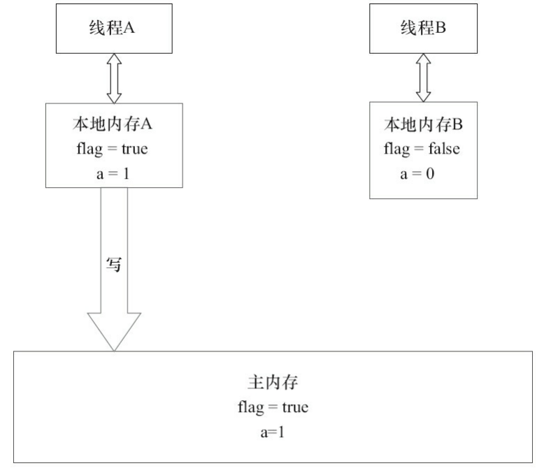

线程A在写flag变量后，本地内存A中被线程A更新过的两个共享变量的值 被刷新到主内存中。此时，本地内存A和主内存中的共享变量的值是一致的

volatile读的内存语义如下。 

> 当读一个volatile变量时，JMM会把该线程对应的本地内存置为无效。线程接下来将从主 内存中读取共享变量。


如图所示，在读flag变量后，本地内存B包含的值已经被置为无效。此时，线程B必须从主 内存中读取共享变量。线程B的读取操作将导致本地内存B与主内存中的共享变量的值变成一 致。

如果我们把volatile写和volatile读两个步骤综合起来看的话，

在读线程B读一个volatile变量后，写线程A在写这个volatile变量之前所有可见的共享变量的值都将立即变得对读线程B可见。


下面对volatile写和volatile读的内存语义做个总结

- 线程A写一个volatile变量，实质上是线程A向接下来将要读这个volatile变量的某个线程发出了（其对共享变量所做修改的）消息
- 线程B读一个volatile变量，实质上是线程B接收了之前某个线程发出的（在写这个volatile 变量之前对共享变量所做修改的）消息。 
- 线程A写一个volatile变量，随后线程B读这个volatile变量，这个过程实质上是线程A通过主内存向线程B发送消息。

### 3.4.4 volatile内存语义的实现

在每个volatile写操作的前面插入一个StoreStore屏障。

在每个volatile写操作的后面插入一个StoreLoad屏障。

在每个volatile读操作的后面插入一个LoadLoad屏障。

在每个volatile读操作的后面插入一个LoadStore屏障。

### 3.4.5 JSR-133为什么要增强volatile的内存语义

在JSR-133之前的旧Java内存模型中，虽然不允许volatile变量之间重排序，但旧的Java内 存模型允许volatile变量与普通变量重排序。

因此，在旧的内存模型中，volatile的写-读没有锁的释放-获所具有的内存语义。为了提供 一种比锁更轻量级的线程之间通信的机制，JSR-133专家组决定增强volatile的内存语义：

严格 限制编译器和处理器对volatile变量与普通变量的重排序，确保volatile的写-读和锁的释放-获 取具有相同的内存语义。

从编译器重排序规则和处理器内存屏障插入策略来看，只要volatile 变量与普通变量之间的重排序可能会破坏volatile的内存语义，这种重排序就会被编译器重排 序规则和处理器内存屏障插入策略禁止。 由于volatile仅仅保证对单个volatile变量的读/写具有原子性，而锁的互斥执行的特性可以 确保对整个临界区代码的执行具有原子性。在功能上，锁比volatile更强大；在可伸缩性和执行 性能上，volatile更有优势。如果读者想在程序中用volatile代替锁，请一定谨慎，具体详情请参 阅Brian Goetz的文章《Java理论与实践：正确使用Volatile变量》。

## 3.5 锁的内存语义

众所周知，锁可以让临界区互斥执行。这里将介绍锁的另一个同样重要，但常常被忽视的 功能：锁的内存语义。

### 3.5.1 锁的释放-获取建立的happens-before关系

锁是Java并发编程中最重要的同步机制。锁除了让临界区互斥执行外，还可以让释放锁的线程向获取同一个锁的线程发送消息。

下面是锁释放-获取的示例代码。

```java
class MonitorExample {
    int a = 0;

    public synchronized void writer() { // 1
        a++;                            // 2
    }                                   // 3

    public synchronized void reader() { // 4
        int i = a;                      // 5
    }                                   // 6
}
```

假设线程A执行writer()方法，随后线程B执行reader()方法。

根据happens-before规则，这个 过程包含的happens-before关系可以分为3类。 

1）根据程序次序规则，1 happens-before 2,2 happens-before 3;4 happens-before 5,5 happensbefore 6。 2）根据监视器锁规则，3 happens-before 4。 

3）根据happens-before的传递性，2 happens-before 5


线程A在释放锁之前所有可见的共享变量，在线程B获取同一个锁之后，将立刻变得 对B线程可见。

### 3.5.2 锁的释放和获取的内存语义

当线程释放锁时，JMM会把该线程对应的本地内存中的共享变量刷新到主内存中。

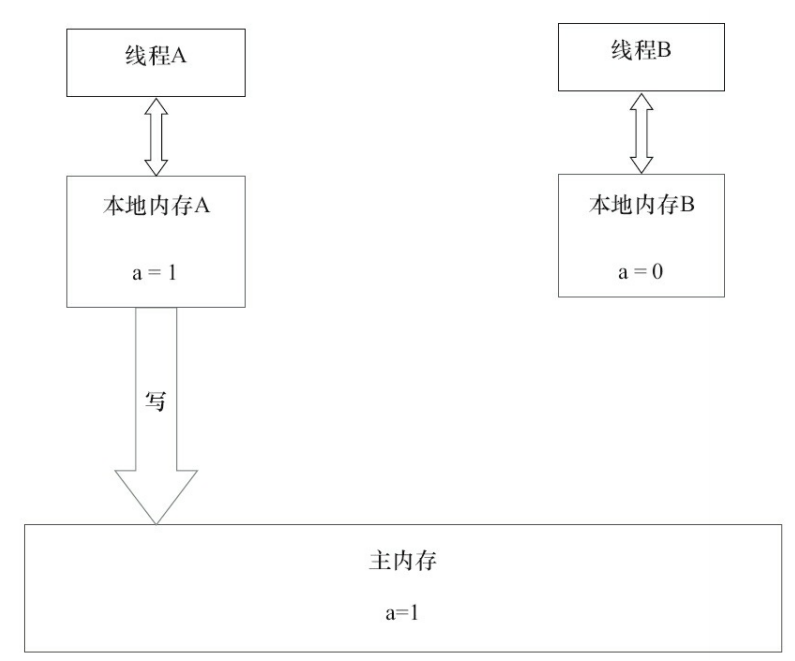

当线程获取锁时，JMM会把该线程对应的本地内存置为无效。从而使得被监视器保护的 临界区代码必须从主内存中读取共享变量。

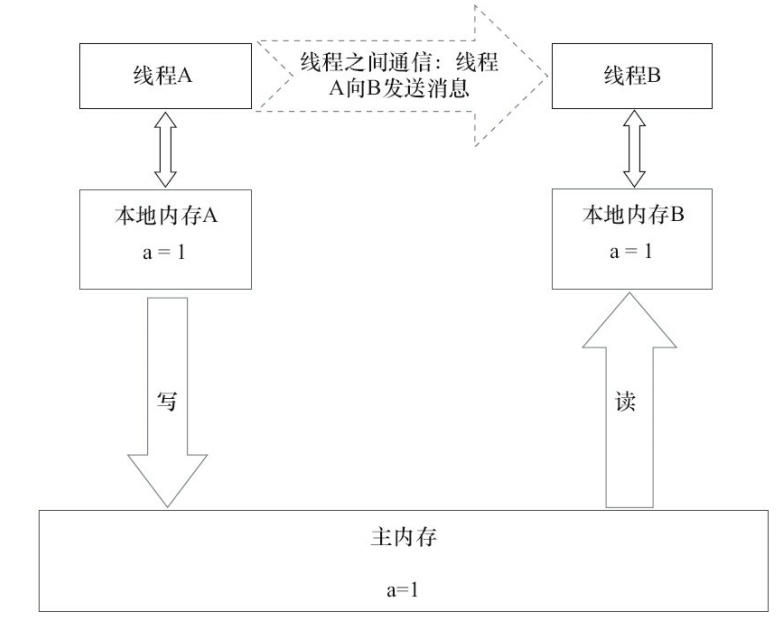

对比锁释放-获取的内存语义与volatile写-读的内存语义可以看出：

锁释放与volatile写有相同的内存语义；锁获取与volatile读有相同的内存语义。 

下面对锁释放和锁获取的内存语义做个总结。

- 线程A释放一个锁，实质上是线程A向接下来将要获取这个锁的某个线程发出了（线程A 对共享变量所做修改的）消息。
- 线程B获取一个锁，实质上是线程B接收了之前某个线程发出的（在释放这个锁之前对共享变量所做修改的）消息。
- 线程A释放锁，随后线程B获取这个锁，这个过程实质上是线程A通过主内存向线程B发送消息。

### 3.5.3 锁内存语义的实现

现在对公平锁和非公平锁的内存语义做个总结。

- 公平锁和非公平锁释放时，最后都要写一个volatile变量state。
- 公平锁获取时，首先会去读volatile变量。 
- 非公平锁获取时，首先会用CAS更新volatile变量，这个操作同时具有volatile读和volatile 写的内存语义。 

从对ReentrantLock的分析可以看出，锁释放-获取的内存语义的实现至少有下面两种 方式。 

1）利用volatile变量的写-读所具有的内存语义。

 2）利用CAS所附带的volatile读和volatile写的内存语义

### 3.5.4 concurrent包的实现

由于Java的CAS同时具有volatile读和volatile写的内存语义，因此Java线程之间的通信现在有了下面4种方式。

- A线程写volatile变量，随后B线程读这个volatile变量。 
- A线程写volatile变量，随后B线程用CAS更新这个volatile变量。 
- A线程用CAS更新一个volatile变量，随后B线程用CAS更新这个volatile变量。 
- A线程用CAS更新一个volatile变量，随后B线程读这个volatile变量。

Java的CAS会使用现代处理器上提供的高效机器级别的原子指令，这些原子指令以原子 方式对内存执行读-改-写操作，这是在多处理器中实现同步的关键（从本质上来说，能够支持 原子性读-改-写指令的计算机，是顺序计算图灵机的异步等价机器，因此任何现代的多处理器 都会去支持某种能对内存执行原子性读-改-写操作的原子指令）。同时，volatile变量的读/写和 CAS可以实现线程之间的通信。把这些特性整合在一起，就形成了整个concurrent包得以实现 的基石。如果我们仔细分析concurrent包的源代码实现，会发现一个通用化的实现模式。

1. 首先，声明共享变量为volatile。
2. 然后，使用CAS的原子条件更新来实现线程之间的同步。 
3. 同时，配合以volatile的读/写和CAS所具有的volatile读和写的内存语义来实现线程之间的通信。

AQS，非阻塞数据结构和原子变量类（java.util.concurrent.atomic包中的类），这些concurrent 包中的基础类都是使用这种模式来实现的，而concurrent包中的高层类又是依赖于这些基础类 来实现的。从整体来看，concurrent包的实现示意如图所示。

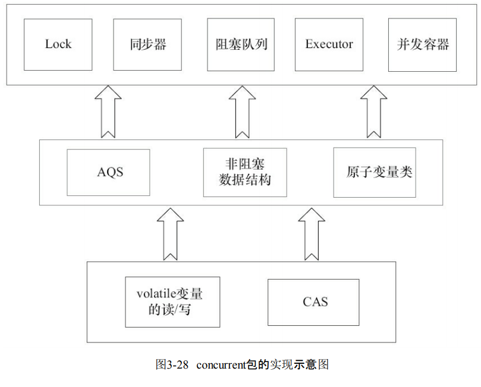

## 3.6 final域的内存语义

与前面介绍的锁和volatile相比，对final域的读和写更像是普通的变量访问。

### 3.6.1 final域的重排序规则

对于final域，编译器和处理器要遵守两个重排序规则。

- 在构造函数内对一个final域的写入，与随后把这个被构造对象的引用赋值给一个引用 变量，这两个操作之间不能重排序。
- 初次读一个包含final域的对象的引用，与随后初次读这个final域，这两个操作之间不能 重排序。

```java
class FinalExample {

    int i; // 普通变量
    final int j; // final变量
    static FinalExample obj;

    public FinalExample() { // 构造函数
        i = 1; // 写普通域
        j = 2; // 写final域
    }

    public static void writer() { // 写线程A执行
        obj = new FinalExample();
    }

    public static void reader() { // 读线程B执行
        FinalExample object = obj; // 读对象引用
        int a = object.i; // 读普通域
        int b = object.j; // 读final域
    }
}
```


这里假设一个线程A执行writer()方法，随后另一个线程B执行reader()方法。下面我们通过 这两个线程的交互来说明这两个规则。

### 3.6.2 写final域的重排序规则

写final域的重排序规则禁止把final域的写 重排序到构造函数之外。

这个规则的实现包含 下面2个方面。 

1. JMM禁止编译器把final域的写重排序到构造函数之外。
2. 编译器会在final域的写之后，构造函数return之前，插入一个StoreStore屏障。这个屏障 禁止处理器把final域的写重排序到构造函数之外。

写final域的重排序规则可以确保：在对象引用为任意线程可见之前，对象的final域已经被正确初始化过了，而普通域不具有这个保障。

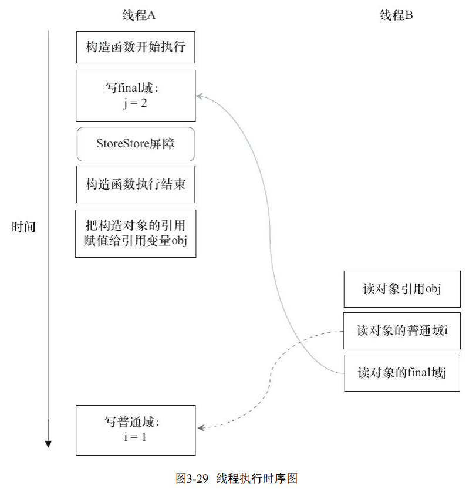

### 3.6.3 读final域的重排序规则

读final域的重排序规则是，在一个线程中，初次读对象引用与初次读该对象包含的final 域，JMM禁止处理器重排序这两个操作（注意，这个规则仅仅针对处理器）。编译器会在读final 域操作的前面插入一个LoadLoad屏障。

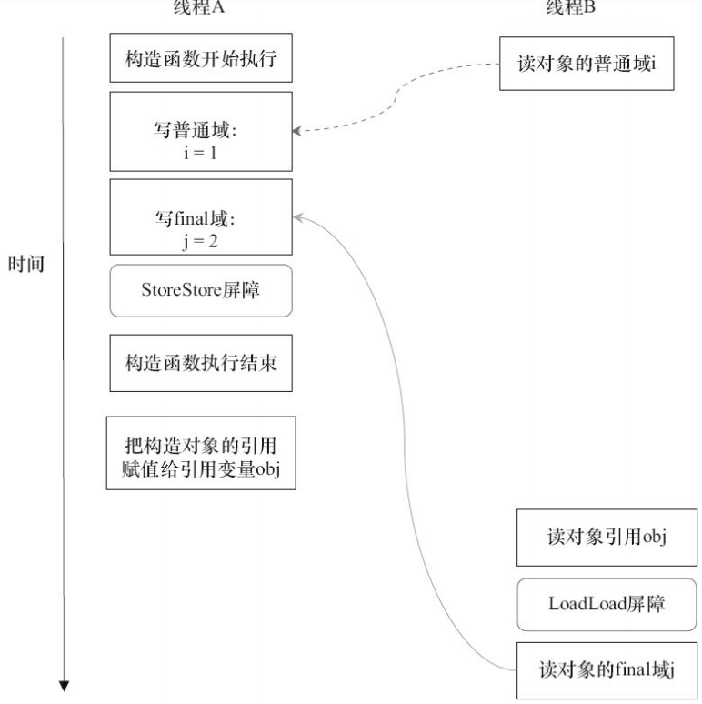

读对象的普通域的操作被处理器重排序到读对象引用之前。读普通域时，该 域还没有被写线程A写入，这是一个错误的读取操作。而读final域的重排序规则会把读对象 final域的操作“限定”在读对象引用之后，此时该final域已经被A线程初始化过了，这是一个正 确的读取操作。

 读final域的重排序规则可以确保：在读一个对象的final域之前，一定会先读包含这个final 域的对象的引用。在这个示例程序中，如果该引用不为null，那么引用对象的final域一定已经 被A线程初始化过了。

### 3.6.4 final域为引用类型

```java

class FinalReferenceExample {
    final int[] intArray; // final是引用类型
    static FinalReferenceExample obj;
    public FinalReferenceExample () { // 构造函数
        intArray = new int[1]; // 1
        intArray[0] = 1; // 2
    }
    public static void writerOne () { // 写线程A执行
        obj = new FinalReferenceExample (); // 3
    }
    public static void writerTwo () { // 写线程B执行
        obj.intArray[0] = 2; // 4
    }
    public static void reader () { // 读线程C执行
        if (obj != null) { // 5
            int temp1 = obj.intArray[0]; // 6
        }
    }
}
```


本例final域为一个引用类型，它引用一个int型的数组对象。

对于引用类型，写final域的重 排序规则对编译器和处理器增加了如下约束：在构造函数内对一个final引用的对象的成员域 的写入，与随后在构造函数外把这个被构造对象的引用赋值给一个引用变量，这两个操作之 间不能重排序。

1是对final域的写入，2是对这个final域引用的对象的成员域的写入，3是把被 构造的对象的引用赋值给某个引用变量。这里除了前面提到的1不能和3重排序外，2和3也不 能重排序。

 JMM可以确保读线程C至少能看到写线程A在构造函数中对final引用对象的成员域的写 入。即C至少能看到数组下标0的值为1。而写线程B对数组元素的写入，读线程C可能看得到， 也可能看不到。JMM不保证线程B的写入对读线程C可见，因为写线程B和读线程C之间存在数 据竞争，此时的执行结果不可预知。 如果想要确保读线程C看到写线程B对数组元素的写入，写线程B和读线程C之间需要使 用同步原语（lock或volatile）来确保内存可见性。

### 3.6.5 为什么final引用不能从构造函数内“溢出”

```java
class FinalReferenceEscapeExample {
    final int i;
    static FinalReferenceEscapeExample obj;
    public FinalReferenceEscapeExample () {
        i = 1; // 1写final域
        obj = this; // 2 this引用在此"逸出"
    }
    public static void writer() {
        new FinalReferenceEscapeExample ();
    }
    public static void reader() {
        if (obj != null) { // 3
            int temp = obj.i; // 4
        }
    }
}
```

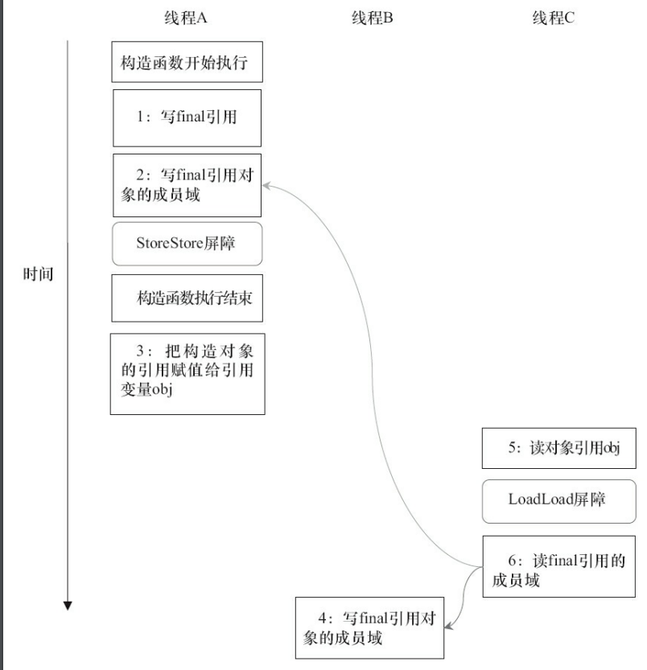

假设一个线程A执行writer()方法，另一个线程B执行reader()方法。这里的操作2使得对象 还未完成构造前就为线程B可见。即使这里的操作2是构造函数的最后一步，且在程序中操作2 排在操作1后面，执行read()方法的线程仍然可能无法看到final域被初始化后的值，因为这里的 操作1和操作2之间可能被重排序。实际的执行时序可能如图所示。


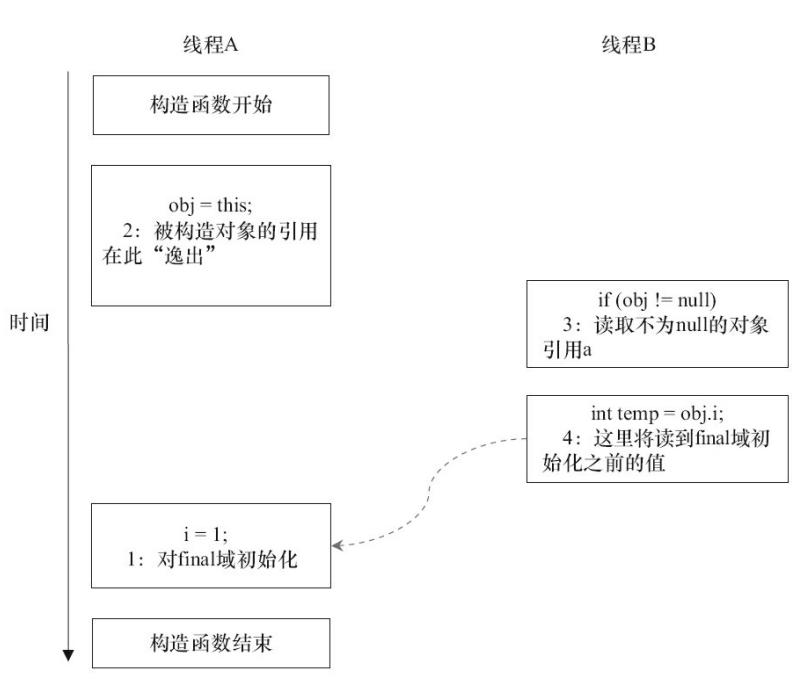

在构造函数返回前，被构造对象的引用不能为其他线程所见，因为此时的final域可能还没有被初始化。在构造函数返回后，任意线程都将保证能看到final域正确初 始化之后的值。

### 3.6.6 final语义在处理器中的实现

现在我们以X86处理器为例，说明final语义在处理器中的具体实现。 

上面我们提到，写final域的重排序规则会要求编译器在final域的写之后，构造函数return 之前插入一个StoreStore障屏。读final域的重排序规则要求编译器在读final域的操作前面插入 一个LoadLoad屏障。 

由于X86处理器不会对写-写操作做重排序，所以在X86处理器中，写final域需要的 StoreStore障屏会被省略掉。同样，由于X86处理器不会对存在间接依赖关系的操作做重排序， 所以在X86处理器中，读final域需要的LoadLoad屏障也会被省略掉。也就是说，在X86处理器 中，final域的读/写不会插入任何内存屏障！

### 3.6.7 JSR-133为什么要增强final的语义

在旧的Java内存模型中，一个最严重的缺陷就是线程可能看到final域的值会改变。比如， 一个线程当前看到一个整型final域的值为0（还未初始化之前的默认值），过一段时间之后这个 线程再去读这个final域的值时，却发现值变为1（被某个线程初始化之后的值）。最常见的例子 就是在旧的Java内存模型中，String的值可能会改变。

 为了修补这个漏洞，JSR-133专家组增强了final的语义。通过为final域增加写和读重排序 规则，可以为Java程序员提供初始化安全保证：只要对象是正确构造的（被构造对象的引用在 构造函数中没有“逸出”），那么不需要使用同步（指lock和volatile的使用）就可以保证任意线程都能看到这个final域在构造函数中被初始化之后的值。

## 3.7 happens-before

### 3.7.1 JMM的设计

首先，让我们来看JMM的设计意图。从JMM设计者的角度，在设计JMM时，需要考虑两个关键因素。

- 程序员对内存模型的使用。程序员希望内存模型易于理解、易于编程。程序员希望基于 一个强内存模型来编写代码。 
- 编译器和处理器对内存模型的实现。编译器和处理器希望内存模型对它们的束缚越少越 好，这样它们就可以做尽可能多的优化来提高性能。编译器和处理器希望实现一个弱内存模 型。

一方面，要为程序员提供足够强的内存可见性保证；另一方面，对编译器和处理 器的限制要尽可能地放松。下面让我们来看JSR-133是如何实现这一目标的。

```java
double pi = 3.14; // A
double r = 1.0; // B
double area = pi * r * r; // C
```

上面计算圆的面积的示例代码存在3个happens-before关系，如下。

- A happens-before B。
- B happens-before C。
- A happens-before C。

在3个happens-before关系中，2和3是必需的，但1是不必要的。因此，JMM把happens-before 要求禁止的重排序分为了下面两类。

- 会改变程序执行结果的重排序。
- 不会改变程序执行结果的重排序。

JMM对这两种不同性质的重排序，采取了不同的策略，如下。

- 对于会改变程序执行结果的重排序，JMM要求编译器和处理器必须禁止这种重排序。 
- 对于不会改变程序执行结果的重排序，JMM对编译器和处理器不做要求（JMM允许这种 重排序）。

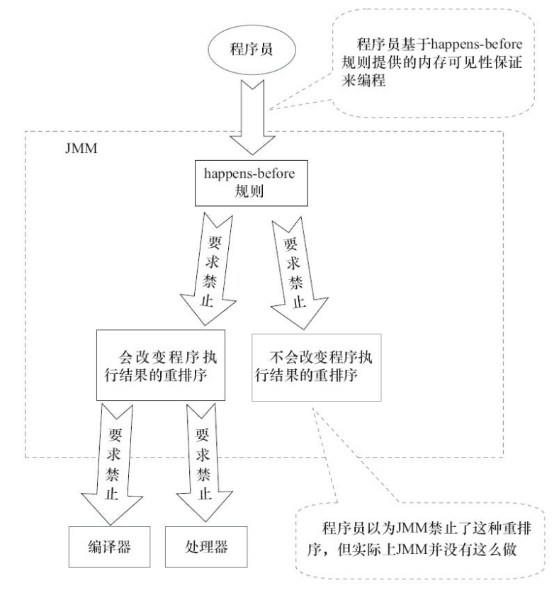

JMM其实是在遵 循一个基本原则：只要不改变程序的执行结果（指的是单线程程序和正确同步的多线程程序）， 编译器和处理器怎么优化都行。

### 3.7.2 happens-before的定义

JSR-133使用happens-before的概念来指定两个操作之间的执行顺序。

由于这两个操作可以在一个线程之内，也可以是在不同线程之间。因此，JMM可以通过happens-before关系向程序 员提供跨线程的内存可见性保证（如果A线程的写操作a与B线程的读操作b之间存在happensbefore关系，尽管a操作和b操作在不同的线程中执行，但JMM向程序员保证a操作将对b操作可 见）。


如果一个操作happens-before另一个操作，那么第一个操作的执行结果将对第二个操作 可见，而且第一个操作的执行顺序排在第二个操作之前。 

两个操作之间存在happens-before关系，并不意味着Java平台的具体实现必须要按照 happens-before关系指定的顺序来执行。如果重排序之后的执行结果，与按happens-before关系 来执行的结果一致，那么这种重排序并不非法（也就是说，JMM允许这种重排序）。

### 3.7.3 happens-before规则

- 程序顺序规则：一个线程中的每个操作，happens-before于该线程中的任意后续操作。 
- 监视器锁规则：对一个锁的解锁，happens-before于随后对这个锁的加锁。
- volatile变量规则：对一个volatile域的写，happens-before于任意后续对这个volatile域的读。
- 传递性：如果A happens-before B，且B happens-before C，那么A happens-before C。
- start()规则：如果线程A执行操作ThreadB.start()（启动线程B），那么A线程的 ThreadB.start()操作happens-before于线程B中的任意操作。
- join()规则：如果线程A执行操作ThreadB.join()并成功返回，那么线程B中的任意操作 happens-before于线程A从ThreadB.join()操作成功返回。


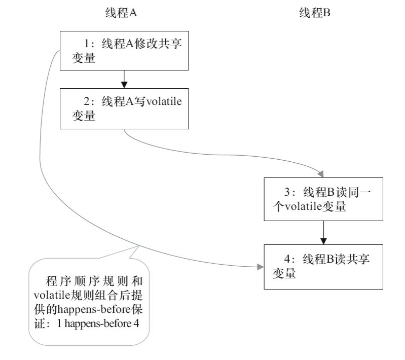

- 1 happens-before 2和3 happens-before 4由程序顺序规则产生。由于编译器和处理器都要 遵守as-if-serial语义，也就是说，as-if-serial语义保证了程序顺序规则。因此，可以把程序顺序 规则看成是对as-if-serial语义的“封装”。
- 2 happens-before 3是由volatile规则产生。前面提到过，对一个volatile变量的读，总是能看 到（任意线程）之前对这个volatile变量最后的写入。因此，volatile的这个特性可以保证实现 volatile规则。 
- 1 happens-before 4是由传递性规则产生的。这里的传递性是由volatile的内存屏障插入策 略和volatile的编译器重排序规则共同来保证的。

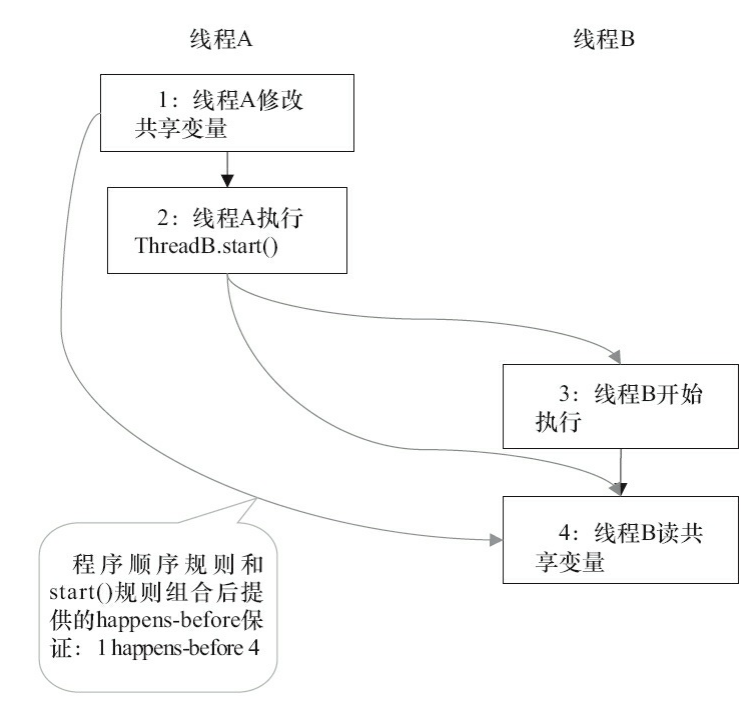

1 happens-before 2由程序顺序规则产生。2 happens-before 4由start()规则产 生。根据传递性，将有1 happens-before 4。这实意味着，线程A在执行ThreadB.start()之前对共享 变量所做的修改，接下来在线程B开始执行后都将确保对线程B可见。

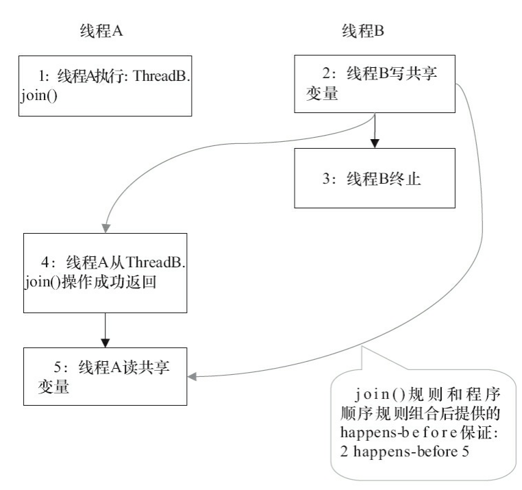

2 happens-before 4由join()规则产生；4 happens-before 5由程序顺序规则产生。 根据传递性规则，将有2 happens-before 5。这意味着，线程A执行操作ThreadB.join()并成功返 回后，线程B中的任意操作都将对线程A可见。

## 3.8 双重检查锁定与延迟初始化

在Java多线程程序中，有时候需要采用延迟初始化来降低初始化类和创建对象的开销。双 重检查锁定是常见的延迟初始化技术，但它是一个错误的用法。本文将分析双重检查锁定的 错误根源，以及两种线程安全的延迟初始化方案。

### 3.8.1 双重检查锁定的由来

```java
public class UnsafeLazyInitialization {
    private static Instance instance;
    public static Instance getInstance() {
        if (instance == null) // 1：A线程执行
            instance = new Instance(); // 2：B线程执行
        return instance;
    }
}

```

在UnsafeLazyInitialization类中，假设A线程执行代码1的同时，B线程执行代码2。此时，线 程A可能会看到instance引用的对象还没有完成初始化

对于UnsafeLazyInitialization类，我们可以对getInstance()方法做同步处理来实现线程安全 的延迟初始化。示例代码如下。

```java
public class SafeLazyInitialization {
    private static Instance instance;
    public synchronized static Instance getInstance() {
        if (instance == null)
            instance = new Instance();
        return instance;
    }
}
```

由于对getInstance()方法做了同步处理，synchronized将导致性能开销。如果getInstance()方 法被多个线程频繁的调用，将会导致程序执行性能的下降。反之，如果getInstance()方法不会被 多个线程频繁的调用，那么这个延迟初始化方案将能提供令人满意的性能。


双重检查 锁定来降低同步的开销。下面是使用双重检查锁定来实现延迟初始化的示例代码

```java

public class DoubleCheckedLocking {                     // 1
    private static Instance instance;                   // 2
    public static Instance getInstance() {              // 3
        if (instance == null) {                         //4:第一次检查
            synchronized (DoubleCheckedLocking.class) { // 5:加锁
                if (instance == null)                   // 6:第二次检查
                    instance = new Instance();          // 7:问题的根源出在这里
            }                                           // 8
        }                                               // 9
        return instance;                                // 10
    }                                                   // 11
}
```

在线程执行到第4行，代码读 取到instance不为null时，instance引用的对象有可能还没有完成初始化!!!

### 3.8.2 问题的根源

前面的双重检查锁定示例代码的第7行（instance=new Singleton();）创建了一个对象。这一 行代码可以分解为如下的3行伪代码。

```java
memory = allocate(); // 1：分配对象的内存空间
ctorInstance(memory); // 2：初始化对象
instance = memory; // 3：设置instance指向刚分配的内存地址
```

上面3行伪代码中的2和3之间，可能会被重排序（在一些JIT编译器上，这种重排序是真实 发生的，详情见参考文献1的“Out-of-order writes”部分）。2和3之间重排序之后的执行时序如 下。

```java
memory = allocate(); // 1：分配对象的内存空间
instance = memory; // 3：设置instance指向刚分配的内存地址
					// 注意，此时对象还没有被初始化！
ctorInstance(memory); // 2：初始化对象
```

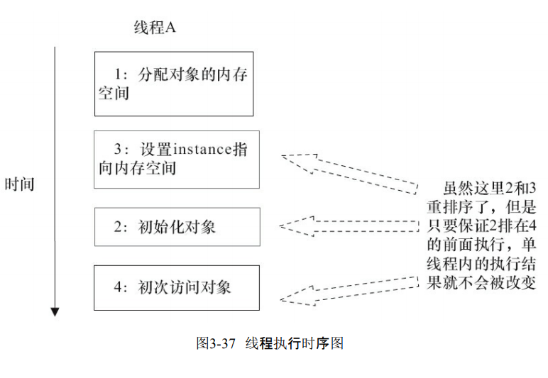


DoubleCheckedLocking示例代码的第7行（instance=new Singleton();）如果 发生重排序，另一个并发执行的线程B就有可能在第4行判断instance不为null。线程B接下来将 访问instance所引用的对象，但此时这个对象可能还没有被A线程初始化！

### 3.8.3 基于volatile的解决方案

对于前面的基于双重检查锁定来实现延迟初始化的方案（指DoubleCheckedLocking示例代 码），只需要做一点小的修改（把instance声明为volatile型），就可以实现线程安全的延迟初始 化。请看下面的示例代码。

```java
public class SafeDoubleCheckedLocking {
    private volatile static Instance instance;
    public static Instance getInstance() {
        if (instance == null) {
            synchronized (SafeDoubleCheckedLocking.class) {
                if (instance == null)
                    instance = new Instance(); // instance为volatile，现在没问题了
            }
        }
        return instance;
    }
}

```

### 3.8.4 基于类初始化的解决方案

JVM在类的初始化阶段（即在Class被加载后，且被线程使用之前），会执行类的初始化。在 执行类的初始化期间，JVM会去获取一个锁。这个锁可以同步多个线程对同一个类的初始化。

 基于这个特性，可以实现另一种线程安全的延迟初始化方案（这个方案被称之为 Initialization On Demand Holder idiom）。

```java
public class InstanceFactory {
    private static class InstanceHolder {
        public static Instance instance = new Instance();
    }
    public static Instance getInstance() {
        return InstanceHolder.instance ; // 这里将导致InstanceHolder类被初始化
    }
}

```

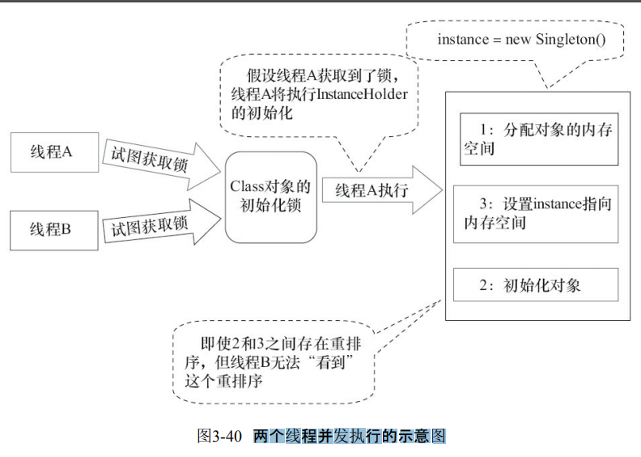

这个方案的实质是：允许3.8.2节中的3行伪代码中的2和3重排序，但不允许非构造线程（这 里指线程B）“看到”这个重排序

初始化一个类，包括执行这个类的静态初始化和初始化在这个类中声明的静态字段。根 据Java语言规范，在首次发生下列任意一种情况时，一个类或接口类型 T 将被立即初始化。

1）T是一个类，而且一个T类型的实例被创建。

2）T是一个类，且T中声明的一个静态方法被调用。 

3）T中声明的一个静态字段被赋值。 

4）T中声明的一个静态字段被使用，而且这个字段不是一个常量字段。 

5）T是一个顶级类（Top Level Class，见Java语言规范的§7.6），而且一个断言语句嵌套在T 内部被执行。


# 第四章 Java并发编程基础

