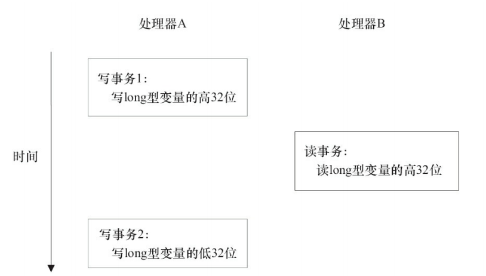
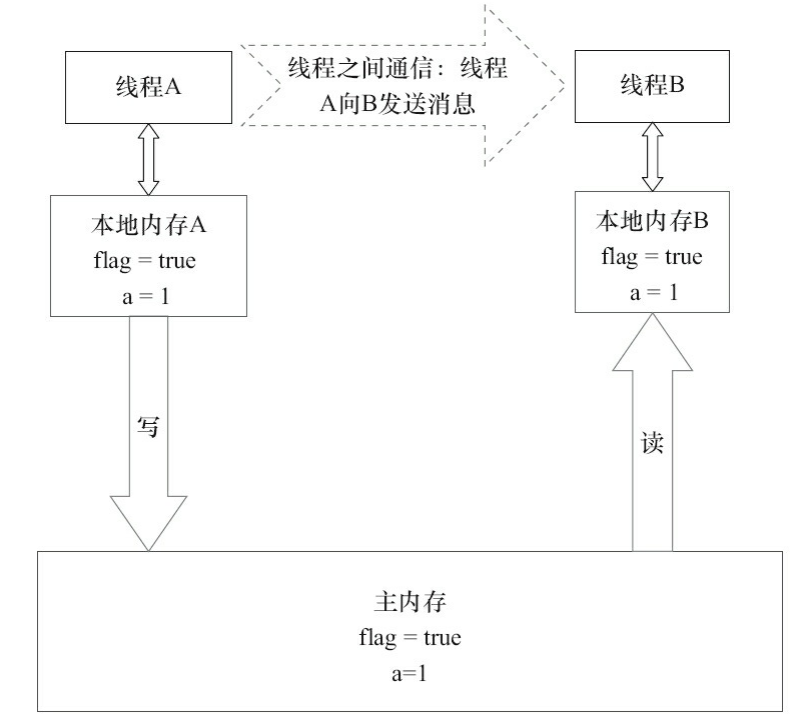

# 第三章 Java内存模型

## 3.1 Java内存模型的基础

### 3.1.1 并发编程模型的两个关键问题

#### 线程之间如何通信

##### 共享内存

线程之间共享程序的公共状态

##### 消息传递

没有公共状态 通过发送消息进行显式通信

#### 线程之间如何同步

同步是程序中用于控制不同线程间操作发生的相对顺序

Java采用共享内存的方式

### 3.1.2 Java内存模型的抽象结构

Java内存模型 JMM

线程之间的共享变量存在主存中,没有线程都有一个私有的本地内存,本地内存中存储了该线程以读/写共享变量的副本.

线程A 与 线程B 通信 步骤

线程A 把本地内存A中更新过的共享变量刷新到主内存中取

线程B 从 主内存中取读取线程A之前更新后的共享变量


### 3.1.3 从源代码到指令序列的重排序

三种重排序

1. 编译器优化的重排序: 程序在不改变**单线程程序语义**的前提下,可以重新安排语句的执行顺序
2. 指令级并行的重排序:如果不存在**数据依赖**,处理器可以改变语句对应机器指令的执行顺序
3. 内存系统的重排序:  由于处理器使用**缓存和读/写缓冲区**,这使得加载和存储操作看上去可能实在乱序执行

1属于编译器重排序  2和3属于处理器重排序

JMM 对于编译器:  JMM的编译器会根据重排序规则禁止特定类型的**编译器重排序**

JMM对于处理器:   JMM 要求要求Java编译器在生成指令序列时,***插入特定类型的内存屏障**指令,通过内存屏障指令来禁止某种特定类型的处理器重排序


通过上述两个方式  提供了一致的内存可见性保证

### 3.1.4 并发编程模型的分类

写缓冲区---> 允许对写--读操作进行重排序

内存屏障类型:

LoadLoad

LoadStore

StoreStore

StoreLoad: Store1 ;StoreLoad;Load2 确保Store1 数据对其他处理器变得可见(刷新到内存)

先于Load2 及所有后续装载指令的装载

### 3.1.5 happens-before 简介

在JMM中  如果一个操作的结果需要对另一个操作可见,那么这两个操作必须要存在happens-before 关系

相关规则如下:

程序顺序规则: 一个线程的每个操作,happens-before 于线程中的任意后续操作

监视器锁规则: 对一个锁的解锁,happens-before 于随后对这个锁的加锁

volatile变量规则: 对volatile变量的写,happens-before 于随后对这个变量的读

传递性: A hb B  且 B hb C  则  A hb C


注意:

两个操作之间存在happens-before 关系,并不意味着 前一个操作必须要在后一个操作之前执行!!!!!!!

happens-before 仅仅要求前一个操作(执行的结果) 对后一个操作可见,且前一个操作按顺序排在后一个操作之前


## 3.2 重排序

重排序是指 编译器和处理器为了优化程序性能而对指令序列进行重新排序的一种手段

### 3.2.1  数据依赖

如果两个操作访问同一个变量, 且其中一个操作为写操作,那么这两个操作就存在数据依赖性

分为三类

- [ ] |  名称  | 代码示例 |           说明            |
  | :----: | :------: | :-----------------------: |
  | 写后读 | a=1;b=a; | 写一个变量后,在读这个变量 |
  | 写后写 | a=1;a=2; | 写一个变量后,在写这个变量 |
  | 读后写 | b=a;a=1; | 读一个变量后,在写这个变量 |

对于存在数据依赖的操作,编译器和处理器不会对其进行重排序

### 3.2.2 as-is-serial

as-is-serial 不管怎样重排序,(单线程)程序的执行结果不会被改变


```java
double pi = 3.14; //A
double r = 1.0; //B
double area = pi * r * r //C
```

AC存在数据依赖 BC存在数据依赖 执行顺序可能为:

A-B-C

B-A-C

### 3.2.3  程序顺序规则

两个操作之间存在happens-before 关系,并不意味着 前一个操作必须要在后一个操作之前执行!!!!!!!

happens-before 仅仅要求前一个操作(执行的结果) 对后一个操作可见,且前一个操作按顺序排在后一个操作之前

```
happens-before A hb B  B hb C ---> A hb C
```

### 3.2.4 重排序对多线程的影响

```java
public class ReorderExample {
    int a = 0;
    boolean flag = false;

    /**
     * 操作1和2 无数据依赖 可能发生重排序
     */
    public void writer() {
        a = 1;       // 1
        flag = true; // 2
    }

    /**
     * 操作3和4 存在控制依赖关系 编译器和处理器采取 猜测 执行
     * 重排序缓冲
     */
    public void reader() {
        if (flag) {   // 3
            int i = a * a;// 4
            System.out.println(i);
        }
    }
}
```

当有两个线程A和B  ,A 先执行writer  B 后执行reader

操作1和2发生重排序

程序的执行顺序可能如下:


线程A 对于a的赋值 对于B来说 没有用到!!!!1


操作3和4发生重排序


当代码中存在控制依赖性时，会影响指令序 列执行的并行度。为此，编译器和处理器会采用猜测（Speculation）执行来克服控制相关性对并 行度的影响。以处理器的猜测执行为例，执行线程B的处理器可以提前读取并计算a*a，然后把 计算结果临时保存到一个名为重排序缓冲（Reorder Buffer，ROB）的硬件缓存中。当操作3的条 件判断为真时，就把该计算结果写入变量i中。 从图中我们可以看出，猜测执行实质上对操作3和4做了重排序。重排序在这里破坏了 多线程程序的语义！


总结:

在单线程程序中，对存在控制依赖的操作重排序，不会改变执行结果（这也是as-if-serial 语义允许对存在控制依赖的操作做重排序的原因）；

但在多线程程序中，对存在**控制依赖**的操作重排序，可能会改变程序的执行结果


## 3.3 顺序一致性

顺序一致性内存模型是一个理论参考模型，在设计的时候，处理器的内存模型和编程语 言的内存模型都会以顺序一致性内存模型作为参照。

### 3.3.1 数据竞争和数据一致性

当程序未正确同步时,就可能发生数据竞争

JMM 对数据竞争的定义:

  在一个线程写入变量,

  在另一个线程读取同一个变量,

  而且写和读没有通过同步来排序

JMM对正确同步的多线程程序的内存一致性做了如下保证。

如果程序是正确同步的，程序的执行将具有顺序一致性（Sequentially Consistent）——即程序的执行结果与该程序在顺序一致性内存模型中的执行结果相同。

这里的同步是指广义上的同步，包括对常用同步原语 （synchronized、volatile和final）的正确使用

### 3.3.2 顺序一致性内存模型

顺序一致性内存模型是一个被计算机科学家**理想化了的理论参考模型**，它为程序员提供 了极强的**内存可见性**保证。顺序一致性内存模型有两大特性。

1）一个线程中的所有操作必须按照程序的顺序来执行。

 2）（不管程序是否同步）所有线程都只能看到一个单一的操作执行顺序。在顺序一致性内 存模型中，每个操作都必须原子执行且立刻对所有线程可见。

### 3.3.3 同步程序的顺序一致性效果

```java
class SynchronizedExample {
    int a = 0;
    boolean flag = false;

    public synchronized void writer() { // 获取锁
        a = 1;
        flag = true;
    } 									// 释放锁

    public synchronized void reader() { // 获取锁
        if (flag) {
            int i = a;

        } 								// 释放锁
    }
}

```

假设A线程执行writer()方法后，B线程执行reader()方法。


顺序一致性模型中，所有操作完全按程序的顺序串行执行。

而在JMM中，临界区内的代码 可以重排序（但JMM不允许临界区内的代码“逸出”到临界区之外，那样会破坏监视器的语 义）。

从这里可以看到，JMM在具体实现上的基本方针为：在不改变（正确同步的）程序执行结果的前提下，尽可能地为编译器和处理器的优化打开方便之门。

### 3.3.4 未同步程序的执行特性

对于未同步或未正确同步的多线程程序，JMM只提供最小安全性：线程执行时读取到的值，要么是之前某个线程写入的值，要么是默认值（0，Null，False），JMM保证线程读操作读取到的值不会无中生有Out Of Thin Air）的冒出来。

为了实现最小安全性，JVM在堆上分配对象 时，首先会对内存空间进行清零，然后才会在上面分配对象（JVM内部会同步这两个操作）。因 此，在已清零的内存空间（Pre-zeroed Memory）分配对象时，域的默认初始化已经完成了


未同步程序在JMM中的执行时，整体上是无序的，其执行结果无法预知。未同步程序在两 个模型中的执行特性有如下几个差异。 

1）顺序一致性模型保证单线程内的操作会按程序的顺序执行，而JMM不保证单线程内的操作会按程序的顺序执行（比如上面正确同步的多线程程序在临界区内的重排序）。

 2）顺序一致性模型保证所有线程只能看到一致的操作执行顺序，而JMM不保证所有线程 能看到一致的操作执行顺序。

 3）JMM不保证对64位的long型和double型变量的写操作具有原子性，而顺序一致性模型保 证对所有的内存读/写操作都具有原子性。


第3个差异与处理器总线的工作机制密切相关。

在计算机中，数据通过总线在处理器和内 存之间传递。每次处理器和内存之间的数据传递都是通过一系列步骤来完成的，这一系列步 骤称之为总线事务（Bus Transaction）。

总线事务包括读事务（Read Transaction）和写事务（Write Transaction）。

读事务从内存传送数据到处理器，写事务从处理器传送数据到内存

每个事务会 读/写内存中一个或多个物理上连续的字。这里的关键是，总线会同步试图并发使用总线的事 务。在一个处理器执行总线事务期间，总线会禁止其他的处理器和I/O设备执行内存的读/写。

在一些32位的处理器上，如果要求对64位数据的写操作具有原子性，会有比较大的开销。 

为了照顾这种处理器，Java语言规范鼓励但不强求JVM对64位的long型变量和double型变量的写操作具有原子性。当JVM在这种处理器上运行时，可能会把一个64位long/double型变量的写操作拆分为两个32位的写操作来执行。这两个32位的写操作可能会被分配到不同的总线事务 中执行，此时对这个64位变量的写操作将不具有原子性。



如上图所示，假设处理器A写一个long型变量，同时处理器B要读这个long型变量。处理器 A中64位的写操作被拆分为两个32位的写操作，且这两个32位的写操作被分配到不同的写事 务中执行。同时，处理器B中64位的读操作被分配到单个的读事务中执行。当处理器A和B按上 图的时序来执行时，处理器B将看到仅仅被处理器A“写了一半”的无效值

在JSR-133之前的旧内存模型中，一个64位long/double型变量的读/写操作可以被拆分为两个32位的读/写操作来执行。从JSR-133内存模型开始（即从JDK5开始），仅仅只允许把 一个64位long/double型变量的写操作拆分为两个32位的写操作来执行，任意的读操作在JSR133中都必须具有原子性（即任意读操作必须要在单个读事务中执行）。


## 3.4 volatile的内存语义

### 3.4.1 volatile的特性

理解volatile特性的一个好方法是把对volatile变量的单个读/写，看成是使用同一个锁对这 些单个读/写操作做了同步。下面通过具体的示例来说明，示例代码如下。


```java

package com.lk.concurrent.thread;

public class VolatileFeaturesExample {

    volatile long vl = 0L; // 使用volatile声明64位的long型变量

    public void set(long l) {
        vl = l; // 单个volatile变量的写
    }

    public void getAndIncrement() {
        vl++; // 复合（多个）volatile变量的读/写
    }

    public long get() {
        return vl; // 单个volatile变量的读
    }

}


class VolatileFeaturesExample2 {

    long vl = 0L; // 64位的long型普通变量

    public synchronized void set(long l) { // 对单个的普通变量的写用同一个锁同步
        vl = l;
    }

    public void getAndIncrement() { // 普通方法调用
        long temp = get(); // 调用已同步的读方法
        temp += 1L; // 普通写操作
        set(temp); // 调用已同步的写方法
    }

    public synchronized long get() { // 对单个的普通变量的读用同一个锁同步
        return vl;
    }


}


```

上述两个程序等价

一个volatile变量的单个读/写操作，与一个普通变量的读/写操作都是使用同一个锁来同步，它们之间的执行效果相同。


锁的语义决定了临界区代码的执行具有原子性。这意味着，即使是64位的long型和double 型变量，只要它是volatile变量，对该变量的读/写就具有原子性。

如果是多个volatile操作或类似于**volatile++**这种复合操作，这些操作**整体上不具有原子性**。

简而言之，volatile变量自身具有下列特性。 

> 可见性。对一个volatile变量的读，总是能看到（任意线程）对这个volatile变量最后的写入。
>
> 原子性：对任意**单个volatile变量的读/写**具有原子性，但类似于**volatile++**这种复合操作不 具有原子性。

### 3.4.2 volatile写-读建立的happens-before关系

从JSR-133开始（即从JDK5开始），volatile变量的写-读可以实现线程之间的通信。

 从内存语义的角度来说，volatile的写-读与锁的释放-获取有相同的内存效果：

volatile写和锁的释放有相同的内存语义；

volatile读与锁的获取有相同的内存语义。

```java
class VolatileExample {
    int a = 0;
    volatile boolean flag = false;

    public void writer() {
        a = 1;               // 1
        flag = true;         // 2
    }

    public void reader() {
        if (flag) {             // 3
            int i = a;          // 4
        }
    }
}

```

假设线程A执行writer()方法之后，线程B执行reader()方法。根据happens-before规则，这个 过程建立的happens-before关系可以分为3类：

1. 根据程序次序规则，1 happens-before 2;3 happens-before 4。 
2. 根据volatile规则，2 happens-before 3。
3. 根据happens-before的传递性规则，1 happens-before 4。

这里A线程写一个volatile变量后，B线程读同一个volatile变量。

**A线程在写volatile变量之前所有可见的共享变量，在B线程读同一个volatile变量后，将立即变得对B线程可见。**

### 3.4.3 volatile写-读的内存语义

volatile写的内存语义如下。 

> 当写一个volatile变量时，JMM会把该线程对应的本地内存中的共享变量值刷新到主内存。


线程A在写flag变量后，本地内存A中被线程A更新过的两个共享变量的值 被刷新到主内存中。此时，本地内存A和主内存中的共享变量的值是一致的

volatile读的内存语义如下。 

> 当读一个volatile变量时，JMM会把该线程对应的本地内存置为无效。线程接下来将从主 内存中读取共享变量。



如图所示，在读flag变量后，本地内存B包含的值已经被置为无效。此时，线程B必须从主 内存中读取共享变量。线程B的读取操作将导致本地内存B与主内存中的共享变量的值变成一 致。

如果我们把volatile写和volatile读两个步骤综合起来看的话，

在读线程B读一个volatile变量后，写线程A在写这个volatile变量之前所有可见的共享变量的值都将立即变得对读线程B可见。


下面对volatile写和volatile读的内存语义做个总结

- 线程A写一个volatile变量，实质上是线程A向接下来将要读这个volatile变量的某个线程发出了（其对共享变量所做修改的）消息
- 线程B读一个volatile变量，实质上是线程B接收了之前某个线程发出的（在写这个volatile 变量之前对共享变量所做修改的）消息。 
- 线程A写一个volatile变量，随后线程B读这个volatile变量，这个过程实质上是线程A通过主内存向线程B发送消息。

### 3.4.4 volatile内存语义的实现

在每个volatile写操作的前面插入一个StoreStore屏障。

在每个volatile写操作的后面插入一个StoreLoad屏障。

在每个volatile读操作的后面插入一个LoadLoad屏障。

在每个volatile读操作的后面插入一个LoadStore屏障。

### 3.4.5 JSR-133为什么要增强volatile的内存语义

在JSR-133之前的旧Java内存模型中，虽然不允许volatile变量之间重排序，但旧的Java内 存模型允许volatile变量与普通变量重排序。

因此，在旧的内存模型中，volatile的写-读没有锁的释放-获所具有的内存语义。为了提供 一种比锁更轻量级的线程之间通信的机制，JSR-133专家组决定增强volatile的内存语义：

严格 限制编译器和处理器对volatile变量与普通变量的重排序，确保volatile的写-读和锁的释放-获 取具有相同的内存语义。

从编译器重排序规则和处理器内存屏障插入策略来看，只要volatile 变量与普通变量之间的重排序可能会破坏volatile的内存语义，这种重排序就会被编译器重排 序规则和处理器内存屏障插入策略禁止。 由于volatile仅仅保证对单个volatile变量的读/写具有原子性，而锁的互斥执行的特性可以 确保对整个临界区代码的执行具有原子性。在功能上，锁比volatile更强大；在可伸缩性和执行 性能上，volatile更有优势。如果读者想在程序中用volatile代替锁，请一定谨慎，具体详情请参 阅Brian Goetz的文章《Java理论与实践：正确使用Volatile变量》。

## 3.5 锁的内存语义

众所周知，锁可以让临界区互斥执行。这里将介绍锁的另一个同样重要，但常常被忽视的 功能：锁的内存语义。

### 3.5.1 锁的释放-获取建立的happens-before关系

锁是Java并发编程中最重要的同步机制。锁除了让临界区互斥执行外，还可以让释放锁的线程向获取同一个锁的线程发送消息。

下面是锁释放-获取的示例代码。

```java
class MonitorExample {
    int a = 0;

    public synchronized void writer() { // 1
        a++;                            // 2
    }                                   // 3

    public synchronized void reader() { // 4
        int i = a;                      // 5
    }                                   // 6
}
```

假设线程A执行writer()方法，随后线程B执行reader()方法。

根据happens-before规则，这个 过程包含的happens-before关系可以分为3类。 

1）根据程序次序规则，1 happens-before 2,2 happens-before 3;4 happens-before 5,5 happensbefore 6。 2）根据监视器锁规则，3 happens-before 4。 

3）根据happens-before的传递性，2 happens-before 5


线程A在释放锁之前所有可见的共享变量，在线程B获取同一个锁之后，将立刻变得 对B线程可见。

### 3.5.2 锁的释放和获取的内存语义

当线程释放锁时，JMM会把该线程对应的本地内存中的共享变量刷新到主内存中。


当线程获取锁时，JMM会把该线程对应的本地内存置为无效。从而使得被监视器保护的 临界区代码必须从主内存中读取共享变量。


对比锁释放-获取的内存语义与volatile写-读的内存语义可以看出：

锁释放与volatile写有相同的内存语义；锁获取与volatile读有相同的内存语义。 

下面对锁释放和锁获取的内存语义做个总结。

- 线程A释放一个锁，实质上是线程A向接下来将要获取这个锁的某个线程发出了（线程A 对共享变量所做修改的）消息。
- 线程B获取一个锁，实质上是线程B接收了之前某个线程发出的（在释放这个锁之前对共享变量所做修改的）消息。
- 线程A释放锁，随后线程B获取这个锁，这个过程实质上是线程A通过主内存向线程B发送消息。

### 3.5.3 锁内存语义的实现

现在对公平锁和非公平锁的内存语义做个总结。

- 公平锁和非公平锁释放时，最后都要写一个volatile变量state。
- 公平锁获取时，首先会去读volatile变量。 
- 非公平锁获取时，首先会用CAS更新volatile变量，这个操作同时具有volatile读和volatile 写的内存语义。 

从对ReentrantLock的分析可以看出，锁释放-获取的内存语义的实现至少有下面两种 方式。 

1）利用volatile变量的写-读所具有的内存语义。

 2）利用CAS所附带的volatile读和volatile写的内存语义

### 3.5.4 concurrent包的实现

由于Java的CAS同时具有volatile读和volatile写的内存语义，因此Java线程之间的通信现在有了下面4种方式。

- A线程写volatile变量，随后B线程读这个volatile变量。 
- A线程写volatile变量，随后B线程用CAS更新这个volatile变量。 
- A线程用CAS更新一个volatile变量，随后B线程用CAS更新这个volatile变量。 
- A线程用CAS更新一个volatile变量，随后B线程读这个volatile变量。

Java的CAS会使用现代处理器上提供的高效机器级别的原子指令，这些原子指令以原子 方式对内存执行读-改-写操作，这是在多处理器中实现同步的关键（从本质上来说，能够支持 原子性读-改-写指令的计算机，是顺序计算图灵机的异步等价机器，因此任何现代的多处理器 都会去支持某种能对内存执行原子性读-改-写操作的原子指令）。同时，volatile变量的读/写和 CAS可以实现线程之间的通信。把这些特性整合在一起，就形成了整个concurrent包得以实现 的基石。如果我们仔细分析concurrent包的源代码实现，会发现一个通用化的实现模式。

1. 首先，声明共享变量为volatile。
2. 然后，使用CAS的原子条件更新来实现线程之间的同步。 
3. 同时，配合以volatile的读/写和CAS所具有的volatile读和写的内存语义来实现线程之间的通信。

AQS，非阻塞数据结构和原子变量类（java.util.concurrent.atomic包中的类），这些concurrent 包中的基础类都是使用这种模式来实现的，而concurrent包中的高层类又是依赖于这些基础类 来实现的。从整体来看，concurrent包的实现示意如图所示。

