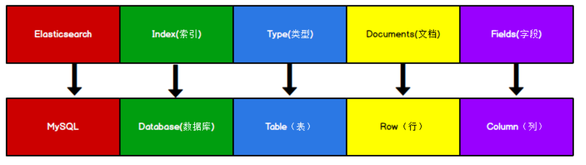
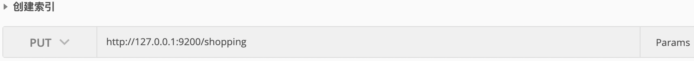
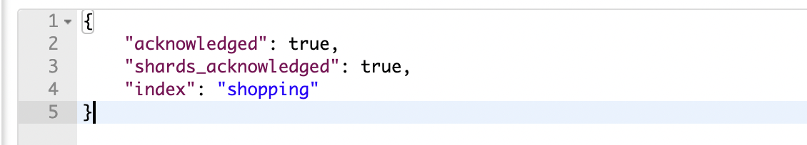

# Elasticsearch 入门

##  Elasticsearch 安装

### 下载软件

Elasticsearch 的官方地址:https://www.elastic.co/cn/

### 安装软件

注意:

9300 端口为 Elasticsearch 集群间组件的通信端口，

9200 端口为浏览器访问的 http 协议 RESTful 端口。

## Elasticsearch 基本操作

### RESTful

REST 指的是一组架构约束条件和原则。满足这些约束条件和原则的应用程序或设计就 是 RESTful。Web 应用程序最重要的 REST 原则是，客户端和服务器之间的交互在请求之 间是无状态的。从客户端到服务器的每个请求都必须包含理解请求所必需的信息。如果服务 器在请求之间的任何时间点重启，客户端不会得到通知。此外，无状态请求可以由任何可用 服务器回答，这十分适合云计算之类的环境。客户端可以缓存数据以改进性能。

在服务器端，应用程序状态和功能可以分为各种资源。资源是一个有趣的概念实体，它 向客户端公开。资源的例子有:应用程序对象、数据库记录、算法等等。每个资源都使用 URI (Universal Resource Identifier) 得到一个唯一的地址。所有资源都共享统一的接口，以便在客 户端和服务器之间传输状态。使用的是标准的 HTTP 方法，比如 GET、PUT、POST 和 DELETE。

在 REST 样式的 Web 服务中，每个资源都有一个地址。资源本身都是方法调用的目 标，方法列表对所有资源都是一样的。这些方法都是标准方法，包括 HTTPGET、POST、 PUT、DELETE，还可能包括 HEAD 和 OPTIONS。简单的理解就是，如果想要访问互联 网上的资源，就必须向资源所在的服务器发出请求，请求体中必须包含资源的网络路径，以 及对资源进行的操作(增删改查)。

#### 幂等性

##### 含义

幂等性原本是数学中的含义，表达的是N次变换与1次变换的结果相同。
而RESTFul API中的幂等性是指调用某个方法1次或N次对资源产生的影响结果都是相同的，需要特别注意的是：这里幂等性指的是对资源产生的影响结果，而不是调用HTTP方法的返回结果。
举个例子，RESTFul API中的GET方法是查询资源信息，不会对资源产生影响，所以它是符合幂等性的，但是每次调用GET方法返回的结果有可能不同（可能资源的某个属性在调用GET方法之前已经被其他方法修改了）。
实际上，在分布式架构中的API幂等性不仅仅针对RESTFul接口，而是对所有类型的接口适用，目的是为了确保调用1次或N次接口时对资源的影响结果都是相同的。

##### HTTP方法的幂等性与安全性

RESTFul风格的接口设计本质上使用的是HTTP协议方法，因此，RESTFul接口方法的幂等性指的就是HTTP方法的幂等性。
常用的HTTP方法有：OPTIONS（获取服务器信息），HEAD（请求资源首部信息），GET（获取资源），POST（创建资源），PUT（更新资源全部信息），PATCH（更新资源部分信息），DELETE（删除资源）。那么，这些HTTP方法的幂等性又是什么样的呢？
除了幂等性之外，HTTP方法的安全性是指不对资源产生修改。

| HTTP方法名称 | 是否幂等 | 是否安全 |
| ------------ | -------- | -------- |
| OPTIONS      | Y        | Y        |
| HEAD         | Y        | Y        |
| GET          | Y        | Y        |
| PUT          | Y        | N        |
| DELETE       | Y        | N        |
| POST         | N        | N        |
| PATCH        | N        | N        |

从上述表格中可以看出，HTTP方法的幂等性和安全性并不是同一个概念，如下是对个各个方法的幂等性和安全性解释：

- OPTIONS方法常常用于获取服务器信息，不会对资源产生影响，也不会对资源进行修改，因此它是幂等的也是安全的；OPTIONS方法最常见的场景是在浏览器的跨域请求中，如果浏览器发起的是一个跨域访问的API（不论是GET方法还是POST方法），再真正发送业务的GET或POST方法之前会发送一个OPTIONS方法从服务端获取信息，从服务器返回的信息中得知该请求是否支持跨域访问，从而决定下一步是否能成功发送真正的业务请求。
- HEAD方法用于请求资源的头部信息，不会资源产生影响，也不会对资源进行修改，因此它是幂等的也是安全的。
- GET方法用于获取资源信息，虽然可能每次返回的结果都不相同，但是GET方法本身不会对资源产生影响，在RESTFul语义里GET方法也不会修改资源，因此它是幂等的，也是安全的。
- PUT方法在RESTFul语义里表示对资源进行全量更新，因此调用1次或N次的结果都是一致的，所以它是幂等的，但不是安全的。
- DELETE方法用于删除资源，调用1次或N次的结果都是相同的，因此是幂等的，但不是安全的。
- POST方法在RESTFul语义里表示新建资源，显然调用1次与调用N次的结果不同（调用1次新建1个资源，调用N次新建N个资源），因此不是幂等的，同时也不是安全的。
- PATCH方法在RESTFul语义里表示对资源的局部更新，因此不能保证调用1次与调用N次的结果相同（如：被更新的资源某个属性随着不同的调用次数在变化），所以不是幂等的，同时也不是安全的。

### 数据格式

Elasticsearch 是面向文档型数据库，一条数据在这里就是一个文档。为了方便大家理解，

我们将 Elasticsearch 里存储文档数据和关系型数据库 MySQL 存储数据的概念进行一个类比

ES 里的 Index 可以看做一个库，而 Types 相当于表，Documents 则相当于表的行。

这里 Types 的概念已经被逐渐弱化，Elasticsearch 6.X 中，一个 index 下已经只能包含一个

type，Elasticsearch 7.X 中, Type 的概念已经被删除了。



###  HTTP 操作

#### 索引操作

##### 创建索引

对比关系型数据库，创建索引就等同于创建数据库
在 Postman 中，向 ES 服务器发 PUT 请求 

```es
PUT   http://127.0.0.1:9200/shopping
```





```json
{
	"acknowledged"【响应结果】: true, # true操作成功 
  "shards_acknowledged"【分片结果】: true, # 分片操作成功 
  "index"【索引名称】: "shopping"
}
# 注意:创建索引库的分片数默认 1 片，在 7.0.0 之前的 Elasticsearch 版本中，默认 5 片
```

##### 查看所有索引

在 Postman 中，向 ES 服务器发 GET 请求 :

```http
 GET   http://127.0.0.1:9200/_cat/indices?v
```

这里请求路径中的_cat 表示查看的意思，indices 表示索引，所以整体含义就是查看当前 ES 服务器中的所有索引，就好像 MySQL 中的 show tables 的感觉

| 表头           | 含义                                                         |
| -------------- | ------------------------------------------------------------ |
| health         | 当前服务器健康状态:<br/> green(集群完整) yellow(单点正常、集群不完整) red(单点不正常) |
| status         | 索引打开、关闭状态                                           |
| index          | 索引名                                                       |
| uuid           | 索引统一编号                                                 |
| pri            | 主分片数量                                                   |
| rep            | 副本数量                                                     |
| docs.count     | 可用文档数量                                                 |
| docs.deleted   | 文档删除状态(逻辑删除)                                       |
| store.size     | 主分片和副分片整体占空间大小                                 |
| pri.store.size | 主分片占空间大小                                             |

##### 查看单个索引

在 Postman 中，向 ES 服务器发 请求 :

```http
GET  http://127.0.0.1:9200/shopping
```


```json
{
	"shopping"【索引名】: {
		"aliases"【别名】: {},
		"mappings"【映射】: {},
		"settings"【设置】: {
			  "index"【设置 - 索引】: {
				"creation_date"【设置 - 索引 - 创建时间】: "1614265373911",
				"number_of_shards"【设置 - 索引 - 主分片数量】: "1",
				"number_of_replicas"【设置 - 索引 - 副分片数量】: "1",
				"uuid"【设置 - 索引 - 唯一标识】: "eI5wemRERTumxGCc1bAk2A",
				"version"【设置 - 索引 - 版本】: {
					"created": "7080099"
				},
				"provided_name"【设置 - 索引 - 名称】: "shopping"
			}
		}
	}
}
```

##### 删除索引

在 Postman 中，向 ES 服务器发 DELETE 请求 :

```http
DELETE http://127.0.0.1:9200/shopping
```

```
重新访问索引时，服务器返回响应:索引不存在
```

#### 文档操作

##### 创建文档

索引已经创建好了，接下来我们来创建文档，并添加数据。这里的文档可以类比为关系型数 据库中的表数据，添加的数据格式为 JSON 格式

###### 不指定文档id

不能使用PUT请求

在 Postman 中，向 ES 服务器发 POST 请求 :   

```http
POST  http://127.0.0.1:9200/shopping/_doc

{
"title":"小米手机",
"category":"小米", 
"images":"http://www.xiaomi.com/xm.jpg", 
"price":3999.00
}
```


返回结果：

```json
{
"_index"【索引】: "shopping",
"_type"【类型-文档】: "_doc",
"_id"【唯一标识】: "Xhsa2ncBlvF_7lxyCE9G", #可以类比为MySQL中的主键，随机生成
"_version"【版本】: 1,
"result"【结果】: "created", #这里的create表示创建成功 "_shards"【分片】: {
"total"【分片 - 总数】: 2,
"successful"【分片 - 成功】: 1,
"failed"【分片 - 失败】: 0 },
   "_seq_no": 0,
   "_primary_term": 1
}
```

###### 指定文档id

可以使用POST和PUT

上面的数据创建后，由于没有指定数据唯一性标识(ID)，默认情况下，ES 服务器会随机 生成一个。 如果想要自定义唯一性标识，需要在创建时指定:

```http
POST http://127.0.0.1:9200/shopping/_doc/1

{
"title":"小米手机",
"category":"小米", 
"images":"http://www.xiaomi.com/xm.jpg", 
"price":1999.00
}
```

此处需要注意:如果增加数据时明确数据主键，那么请求方式也可以为 PUT

##### 查看文档

查看文档时，需要指明文档的唯一性标识，类似于 MySQL 中数据的主键查询
在 Postman 中，向 ES 服务器发 GET 请求 :

```http
GET http://127.0.0.1:9200/shopping/_doc/1
```

返回结果

```json
{
"_index"【索引】: "shopping", 
"_type"【文档类型】: "_doc", 
"_id": "1",
"_version": 2,
"_seq_no": 2,
"_primary_term": 2,
"found"【查询结果】: true, # true表示查找到，false表示未查找到 
"_source"【文档源信息】: {
  "title": "华为手机",
  "category": "华为",
  "images": "http://www.xiaomi.com/hw.jpg", 
  "price": 4999.00} 
}
```

##### 修改文档

和新增文档一样，输入相同的 URL 地址请求，如果请求体变化，会将原有的数据内容覆盖

在 Postman 中，向 ES 服务器发 POST 请求 :

```http
POST http://127.0.0.1:9200/shopping/_doc/1

{
"title":"华为手机",
"category":"华为", 
"images":"http://www.huawei.com/hw.jpg",
"price":4999.00
}
```

返回结果

```json
{
    "_index": "shopping",
    "_type": "_doc",
    "_id": "1",
    "_version"【版本】: 2,
    "result"【结果】: "updated", # updated表示数据被更新 "_shards": {
           "total": 2,
           "successful": 1,
           "failed": 0
       },
       "_seq_no": 2,
       "_primary_term": 2
}
```

##### 修改字段

修改数据时，也可以只修改某一条数据的局部信息

在 Postman 中，向 ES 服务器发 POST 请求 : 

```http
POST http://127.0.0.1:9200/shopping/_update/1

##请求体内容为:
{
"doc": {
   "price":30000.00
  }
}
```


##### 删除文档

删除一个文档不会立即从磁盘上移除，它只是被标记成已删除(逻辑删除)。

在 Postman 中，向 ES 服务器发 DELETE 请求 :

```http
DELETE http://127.0.0.1:9200/shopping/_doc/1


```


返回结果

```json
{
  "_index": "shopping",
  "_type": "_doc",
  "_id": "1",
  "_version"【版本】: 4, #对数据的操作，都会更新版本 
  "result"【结果】: "deleted", # deleted表示数据被标记为删除 
  "_shards": {
       "total": 2,
       "successful": 1,
       "failed": 0
   },
   "_seq_no": 4,
   "_primary_term": 2
}
```

##### 条件删除文档

一般删除数据都是根据文档的唯一性标识进行删除，实际操作时，也可以根据条件对多条数据进行删除
 首先分别增加多条数据:

```json
{
"title":"小米手机",
"category":"小米", 
"images":"http://www.gulixueyuan.com/xm.jpg", 
"price":4000.00
} 

{

"title":"华为手机",
"category":"华为", 
"images":"http://www.gulixueyuan.com/hw.jpg", 
"price":4000.00
}
```

向 ES 服务器发 POST 请求 :


```http
POST http://127.0.0.1:9200/shopping/_delete_by_query

{
"query":{
   "match":{
     "price":4000.00
		} 
	}
}
```

返回结果

```json
{
		"took"【耗时】: 175,
		"timed_out"【是否超时】: false,
		"total"【总数】: 2,
		"deleted"【删除数量】: 2,
		"batches": 1,
		"version_conflicts": 0,
		"noops": 0,
		"retries": {
			"bulk": 0,
			"search": 0
		},
		"throttled_millis": 0,
		"requests_per_second": -1.0,
		"throttled_until_millis": 0,
		"failures": []
}
```

#### 映射操作


有了索引库，等于有了数据库中的 database。

接下来就需要建索引库(index)中的映射了，类似于数据库(database)中的表结构(table)。 

创建数据库表需要设置字段名称，类型，长度，约束等;

索引库也一样，需要知道这个类型 下有哪些字段，每个字段有哪些约束信息，这就叫做映射(mapping)。

##### 创建映射

在 Postman 中，向 ES 服务器发 PUT 请求 :http://127.0.0.1:9200/student/_mapping

请求体内容为:

```http
PUT http://127.0.0.1:9200/student/_mapping


{
	"properties":{
		"name":{
			"type":"text",
			"index":true
		},
		"sex":{
			"type":"text",
			"index":false
		},
		"age":{
			 "type":"long",
			 "index":true
		}
	}
}
```

##### 映射数据说明

###### **字段名**

任意填写，下面指定许多属性，例如:title、subtitle、images、price

###### **type**

类型，Elasticsearch中支持的数据类型非常丰富，几个关键的:

​		String 类型，又分两种: 

​			text:可分词

​			keyword:不可分词，数据会作为完整字段进行匹配

​		Numerical:数值类型，分两类

​       	基本数据类型:long、integer、short、byte、double、float、half_float

​       	浮点数的高精度类型:scaled_float 

​		Date:日期类型

​		Array:数组类型

​		Object:对象

###### **index**

是否索引，默认为true，也就是说你不进行任何配置，所有字段都会被索引。

true:字段会被索引，则可以用来进行搜索

false:字段不会被索引，不能用来搜索

###### **store**

是否将数据进行独立存储，默认为 false

原始的文本会存储在_source 里面，默认情况下其他提取出来的字段都不是独立存储 的，是从_source 里面提取出来的。当然你也可以独立的存储某个字段，只要设置 "store": true 即可，获取独立存储的字段要比从_source 中解析快得多，但是也会占用 更多的空间，所以要根据实际业务需求来设置。

######  **analyzer**

分词器，这里的 ik_max_word 即使用 ik 分词器


##### 查看映射

在 Postman 中，向 ES 服务器发 GET 请求 :http://127.0.0.1:9200/student/_mapping

```http
GET http://127.0.0.1:9200/student/_mapping

```

结果

```json
{
    "student": {
        "mappings": {
            "properties": {
                "age": {
                    "type": "long"
                },
                "name": {
                    "type": "text"
                },
                "sex": {
                    "type": "text",
                    "index": false
                }
            }
        }
    }
}
```

##### 索引映射关联

在 Postman 中，向 ES 服务器发 PUT 请求 :

```http
PUT http://127.0.0.1:9200/student

{
  "settings": {},
  "mappings": {
      "properties": {
        "name":{
         "type": "text",
         "index": true
}, "sex":{
         "type": "text",
         "index": false
        },
        "age":{
         "type": "long",
				"index": false
        }
} }
}
```

#### 高级查询

##### 批量增加文档数据 

使用json文件进行新增

在 Postman 中，向 ES 服务器发 POST 请求:http://127.0.0.1:9200/bank/_bulk?pretty&refresh

```http
POST http://127.0.0.1:9200/bank/_bulk?pretty&refresh

选择postman中body中的binary 上传json文件
json格式为
{
 "account_number": 0,
  "balance": 16623,
  "firstname": "Bradshaw",
  "lastname": "Mckenzie",
  "age": 29,
  "gender": "F",
  "address": "244 Columbus Place",
  "employer": "Euron",
  "email": "bradshawmckenzie@euron.com",
  "city": "Hobucken",
  "state": "CO"

}
```


Elasticsearch 提供了基于 JSON 提供完整的查询 DSL 来定义查询

##### 查询所有文档

在 Postman 中，向 ES 服务器发 GET 请求 :http://127.0.0.1:9200/bank/_search

```json
{
"query": {
    "match_all": {

    }
	}
}
#"query":这里的query代表一个查询对象，里面可以有不同的查询属性 
#"match_all":查询类型，例如:match_all(代表查询所有)， match，term ， range 等等 
#{查询条件}:查询条件会根据类型的不同，写法也有差异
#不指定其他任何参数 只有列出最先查出的10条数据
```


返回结果

```json
{
	"took【查询花费时间，单位毫秒】": 1116,
	"timed_out【是否超时】": false,
	"_shards【分片信息】": {
		"total【总数】": 1,
		"successful【成功】": 1,
		"skipped【忽略】": 0,
		"failed【失败】": 0
	},
	"hits【搜索命中结果】": {
			"total"【搜索条件匹配的文档总数】: {
        "value"【总命中计数的值】: 1000,
        "relation"【计数规则】: "eq"#eq 表示计数准确， gte 表示计数不准确
		},
		"max_score【匹配度分值】": 1.0,
		"hits【命中结果集合】": [
      。。。
		}]
}
}
```

##### 单字段排序

sort 可以让我们按照不同的字段进行排序，并且通过 order 指定排序的方式。

desc 降序，asc 升序。 

在 Postman 中，向 ES 服务器发 GET 请求 :http://127.0.0.1:9200/bank/_search

```http
{
    "query": {
        "match_all": {}
    },
    "sort": {
        "account_number": "asc"
    }
}
#sort 根据哪些字段进行降序/升序
```

##### 多字段排序 

假定我们想要结合使用 balance和age 进行查询，

并且匹配的结果首先按照balance排序，然后 按照age排序 

在 Postman 中，向 ES 服务器发 GET 请求 :http://127.0.0.1:9200/bank/_search

```http
{
    "query": {
        "match_all": {}
    },
    "sort": [
        {
            "balance": "asc"
        },
        {
            "age": "desc"
        }
    ]
}
```


##### 分页查询

from：当前页的起始索引，默认从 0 开始。from = (pageNum - 1) * size 

size：每页显示多少条  

在 Postman 中，向 ES 服务器发 GET 请求 :http://127.0.0.1:9200/bank/_search

```http
{
    "query": {
        "match_all": {}
    },
    "sort":{
         "account_number": "asc"
    },
    "from":10,
    "size":20
}
```


##### 匹配查询

match 匹配类型查询，会把查询条件进行分词，然后进行查询，多个词条之间是 or 的关系

在 Postman 中，向 ES 服务器发 GET 请求 :http://127.0.0.1:9200/bank/_search

```http
GET http://127.0.0.1:9200/bank/_search

{
    "query": {
        "match": {
            "address":"mill lane"
        }
    }
}
#match 匹配查询 会根据是否有keyword 进行分词查询
```


##### 字段匹配查询

multi_match 与 match 类似，不同的是它可以在多个字段中查询。

在 Postman 中，向 ES 服务器发 GET 请求 :http://127.0.0.1:9200/bank/_search

```http
{
    "query": {
        "multi_match": {
            "query": "Winnie",
            "fields": [
                "firstname",
                "email"
            ]
        }
    }
}
#query 查询条件
#fields 查询的字段
```

##### 关键字精确查询 

term 查询，精确的关键词匹配查询，不对查询条件进行分词。 

在 Postman 中，向 ES 服务器发 GET 请求 :http://127.0.0.1:9200/bank/_search

```http
{
    "query": {
        "term": {
            "age": {
                "value": "20"
            }
        }
    }
}

#官网注释: 精确查找不适合text字段

Avoid using the term query for text fields.

By default, Elasticsearch changes the values of text fields as part of analysis. This can make finding exact matches for text field values difficult.

To search text field values, use the match query instead.
```

##### 多关键字精确查询 

terms 查询和 term 查询一样，但它允许你指定多值进行匹配。 如果这个字段包含了指定值中的任何一个值，那么这个文档满足条件，类似于 mysql 的 i

在 Postman 中，向 ES 服务器发 GET 请求 :http://127.0.0.1:9200/bank/_search

```httlp
{
    "query": {
        "terms": {
            "age": [
                "20",
                "30",
                "40"
            ]
        }
    }
}
```

##### 指定查询字段

默认情况下，Elasticsearch 在搜索的结果中，会把文档中保存在_source 的所有字段都返回。
 如果我们只想获取其中的部分字段，我们可以添加_source 的过滤 

在 Postman 中，向 ES 服务器发 GET 请求 :http://127.0.0.1:9200/bank/_search

```http
{
    "_source":["account_number","age"],
    "query": {
        "terms": {
            "age": [
                "20","30","40"
            ]
        }
    }
}
```

##### 过滤字段 

也可以通过

includes：来指定想要显示的字段

excludes：来指定不想要显示的字段 

```http
{
    "_source":{
        "includes":["account_number","age"]
    },
    "query": {
        "terms": {
            "age": [
                "20","30","40"
            ]
        }
    }
}
```

##### 组合查询 

***bool***

`bool`把各种其它查询通过`must`（必须 ）、`must_not`（必须不）、`should`（应该）的方 式进行组合 

在 Postman 中，向 ES 服务器发 GET 请求 :http://127.0.0.1:9200/bank/_search

```http
{
    "query": {
        "bool": {
            "must": [
                {
                    "match": {
                        "age": 20
                    }
                }
            ],
            "must_not": [
                {
                    "match": {
                        "gender": "M"
                    }
                }
            ],
            "should": [
                {
                    "match": {
                        "city": "Finzel"
                    }
                }
            ]
        }
    }
}
```

##### 范围查询 

***range*** 查询

range 查询找出那些落在指定区间内的数字或者时间。range 查询允许以下字符 

| 操作符 |    说明    |
| :----: | :--------: |
|   gt   |   大于>    |
|  gte   | 大于等于>= |
|   lt   |   小于<    |
|  lte   | 小于等于<= |

在 Postman 中，向 ES 服务器发 GET 请求 :http://127.0.0.1:9200/bank/_search

```http
{
    "query":{
        "range":{
            "age":{
                "gte":"10",
                "lte":"50"
            }
        }
    }
}
```

##### 模糊查询

***fuzzy***查询

返回包含与搜索字词相似的字词的文档。 

编辑距离是将一个术语转换为另一个术语所需的一个字符更改的次数。这些更改可以包括：

- 更改字符（box → fox)
- 删除字符（black → lack)
- 插入字符（sic → sick)
- 转置两个相邻字符（act → cat） 

为了找到相似的术语，fuzzy 查询会在指定的编辑距离内创建一组搜索词的所有可能的变体 或扩展。然后查询返回每个扩展的完全匹配。

 通过 fuzziness 修改编辑距离。一般使用默认值 AUTO，根据术语的长度生成编辑距离。 

```http
{
    "query": {
        "fuzzy": {
            "address": {
                "value": "Kings",
                "fuzziness": "AUTO"
            }
        }
    }
}
```

##### 高亮查询

在进行关键字搜索时，搜索出的内容中的关键字会显示不同的颜色，称之为高亮。 

Elasticsearch 可以对查询内容中的关键字部分，进行标签和样式(高亮)的设置。 

在使用 match 查询的同时，加上一个 highlight 属性：

- pre_tags：前置标签
- post_tags：后置标签
- fields：需要高亮的字段
- title：这里声明 title 字段需要高亮，后面可以为这个字段设置特有配置，也可以空 


```http
{
    "query": {
        "match": {
            "age": 20
        }
    },
    "highlight": {
        "fields": {
            "firstname": {}
        }
    }
}
```

##### 聚合查询 

聚合允许使用者对 es 文档进行统计分析，类似与关系型数据库中的 group by，当然还有很 多其他的聚合，例如取最大值、平均值等等。 

###### 对某个取最大值max

```http
{
    "aggs":{
        "max_age":{ //该名称随意
            "max":{
                "field":"age"
            }
        }
    },
    "size":0
}
```

###### 对某个字段取最小值min

```http
{
    "aggs":{
        "min_age":{
            "min":{
                "field":"age"
            }
        }
    },
    "size":0
}
```


###### 对某个字段取平均值avg

```http
{
    "aggs":{
        "avg_age":{
            "avg":{
                "field":"age"
            }
        }
    },
    "size":0
}
```

###### 对某个字段的值进行去重之后再取总cardinality

```http
{
    "aggs":{
        "distinct_age":{
            "cardinality":{
                "field":"age"
            }
        }
    },
    "size":0
}
```


###### State 聚合 

stats 聚合，对某个字段一次性返回 count，max，min，avg 和 sum 五个指标 

```http
{
    "aggs": {
        "stats_age": {
            "stats": {
                "field": "age"
            }
        }
    },
    "size": 0
}
```

##### 桶聚合查询

桶聚和相当于 sql 中的 group by 语句 

###### terms 聚合，分组统计 

```http
{
    "aggs":{
        "age_groupby":{
            "terms":{
                "field":"age"
            }
        }
    },
    "size":0
}
```

######  在 terms 分组下再进行聚合 

```htp
{
    "aggs": {
        "age_groupby": {
            "terms": {
                "field": "age"
            },
            "aggs": {
                "sum_age": {
                    "sum": {
                        "field": "age"
                    }
                }
            }
        }
    },
    "size": 0
}
```

