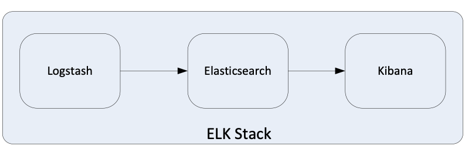
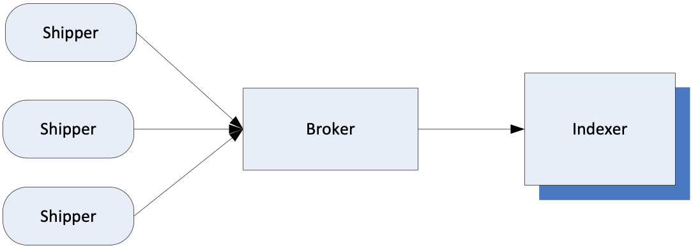
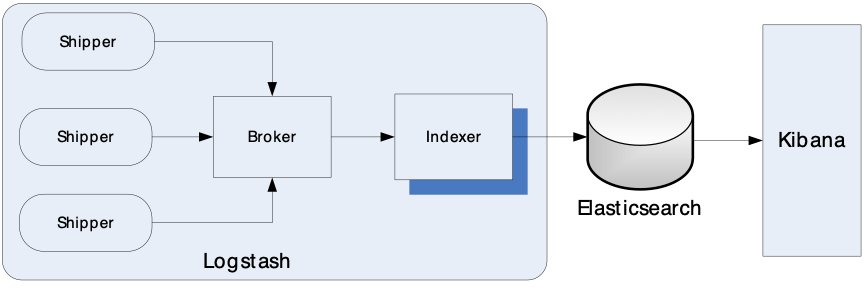

# elk架构

## 核心组成

 ELK是一个应用套件，由Elasticsearch、Logstash和Kibana三部分组件组成，简称ELK；它是一套开源免费、功能强大的日志分析管理系统。ELK可以将我们的系统日志、网站日志、应用系统日志等各种日志进行收集、过滤、清洗，然后进行集中存放并可用于实时检索、分析。

 这三款软件都是开源软件，通常是配合使用，而且又先后归于Elastic.co公司名下，故又被简称为ELK Stack。下图是ELK Stack的基础组成。

## elasticsearch

 Elasticsearch是一个实时的分布式搜索和分析引擎，它可以用于全文搜索，结构化搜索以及分析，采用Java语言编写。它的主要特点如下：

- 实时搜索，实时分析
- 分布式架构、实时文件存储，并将每一个字段都编入索引
- 文档导向，所有的对象全部是文档
- 高可用性，易扩展，支持集群（Cluster）、分片和复制（Shards和Replicas）
- 接口友好，支持JSON

Elasticsearch支持集群架构，典型的集群架构如下图所示：

从图中可以看出，Elasticsearch集群中有Master Node和Slave Node两种角色，其实还有一种角色Client Node

## logstash

Logstash是一款轻量级的、开源的日志收集处理框架，它可以方便的把分散的、多样化的日志搜集起来，并进行自定义过滤分析处理，然后传输到指定的位置，比如某个服务器或者文件。Logstash采用JRuby语言编写，目前最新的版本是Logstash 6.3.2，它的主要特点如下：

 Logstash的理念很简单，从功能上来讲，它只做三件事情：

- input：数据收集
- filter：数据加工，如过滤，改写等
- output：数据输出

别看它只做三件事，但通过组合输入和输出，可以变幻出多种架构实现多种需求。Logstash内部运行逻辑如下图所示：

其中，每个部分含义如下：

- Shipper：主要用来收集日志数据，负责监控本地日志文件的变化，及时把日志文件的最新内容收集起来，然后经过加工、过滤，输出到Broker。
- Broker：相当于日志Hub，用来连接多个Shipper和多个Indexer。(**数据缓冲**)
- Indexer：从Broker读取文本，经过加工、过滤，输出到指定的介质（可以是文件、网络、elasticsearch等）中。 Redis服务器是logstash官方推荐的broker，这个broker起**数据缓存**的作用，通过这个缓存器可以提高Logstash shipper发送日志到Logstash indexer的速度，同时避免由于突然断电等导致的数据丢失。可以实现broker功能的还有很多软件，例如kafka等。

 这里需要说明的是，在实际应用中，LogStash自身并没有什么角色，只是根据不同的功能、不同的配置给出不同的称呼而已，无论是Shipper还是Indexer，始终只做前面提到的三件事。

## kibana

Kibana是一个开源的数据分析可视化平台。使用Kibana可以为Logstash和ElasticSearch提供的日志数据进行高效的搜索、可视化汇总和多维度分析，还可以与Elasticsearch搜索引擎之中的数据进行交互。它基于浏览器的界面操作可以快速创建动态仪表板，实时监控ElasticSearch的数据状态与更改。

## ELK工作流程

一般都是在需要收集日志的所有服务上部署logstash，作为logstash shipper用于监控并收集、过滤日志，接着，将过滤后的日志发送给Broker，然后，Logstash Indexer将存放在Broker中的数据再写入Elasticsearch，Elasticsearch对这些数据创建索引，最后由Kibana对其进行各种分析并以图表的形式展示。

有些时候，如果收集的日志量较大，为了保证日志收集的性能和数据的完整性，logstash shipper和logstash indexer之间的缓冲器（Broker）也经常采用kafka来实现。

 在这个图中，要重点掌握的是ELK架构的数据流向，以及logstash、Elasticsearch和Kibana组合实现的功能细节。

