##客官，这是一份精心编写的《Redis设计与实现》读书心得（上篇）

### 第15章 复制

在Redis中，可以通过执行SLAVEOF命令或者设置slaveof选项，让从服务器来备份主服务器上的数据。
Redis的复制功能主要分为同步和命令传播。
同步主要是指从服务器的状态更新为主服务器的状态。同步具体又细分为完整重同步和部分重同步（Redis 2.8以后的版本才有）。
#####完整重同步
一般是从服务器向主服务器发送命令请求，主服务向从服务器发送RDB文件及缓冲区保存的写命令，从服务器根据RDB文件和缓冲区保存的写命令恢复数据库状态。
具体步骤如下：
1）从服务器向主服务器发送SYNC命令。
2）收到SYNC命令的主服务器执行BGSAVE命令，在后台生成一个RDB文件，并使用一个缓冲区记录从现在开始执行的所有写命令。
3）当主服务器的BGSAVE命令执行完毕时，主服务器会将BGSAVE命令生成的RDB文件发送给从服务器，从服务器接收并载入这个RDB文件，将自己的数据库状态更新至主服务器执行BGSAVE命令时的数据库状态。
4）主服务器将记录在缓冲区里面的所有写命令发送给从服务器，从服务器执行这些写命令，将自己的数据库状态更新至主服务器数据库当前所处的状态。
如下图所示：
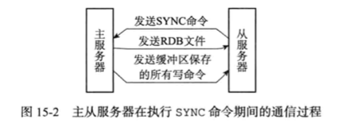

#####命令传播
在同步操作执行完毕之后的这个时间点，主从服务器两者的数据库将达到一致状态。但之后当主服务器执行客户端发送的写命令时，主服务器的数据库就有可能会被修改，并导致主从服务器状态不再一致，所以命令传播就是主服务器执行一条写命令后，也会把这条写命令发送给从服务器执行。
#####部分重同步（Redis2.8以后版本才有）
对于从服务器初次复制的场景来说，完整重同步+命令传播已经可以完美得满足需求了，但是如果从服务器是断线后重复制，因为从服务器本身拥有主服务器的数据，只是缺少断线期间的数据修改，采用完整重同步+命令传播会效率比较低。所以就有了部分重同步只会向从服务器发送断线期间的写命令。
部分重同步的实现由三部分组成，复制偏移量，复制积压缓冲区，服务器运行ID。
复制偏移量
指的是执行复制的双方——主服务器和从服务器会分别维护一个复制偏移量：
·主服务器每次向从服务器传播N个字节的数据时，就将自己的复制偏移量的值加上N。
·从服务器每次收到主服务器传播来的N个字节的数据时，就将自己的复制偏移量的值加上N。
这样通过对比主从服务器的复制偏移量可以知道主从服务器目前的数据状态。
复制积压缓冲区
复制积压缓冲区是由主服务器维护的一个固定长度先进先出队列，保存了主服务器执行的写命令。默认大小为1MB。队列长度是固定的，当元素满了时，会将最先入队的元素弹出，再将新元素放入队列。
服务器运行ID
每个Redis服务器，不论主服务器还是从服务，都会有自己的运行ID。当从服务器对主服务器进行初次复制时，主服务器会将自己的运行ID传送给从服务器，而从服务器则会将这个运行ID保存起来。
当从服务器断线并重新连上一个主服务器时，从服务器将向当前连接的主服务器发送之前保存的运行ID：
·如果从服务器保存的运行ID和当前连接的主服务器的运行ID相同，那么说明从服务器断线之前复制的就是当前连接的这个主服务器，主服务器可以继续尝试执行部分重同步操作。
·相反地，如果从服务器保存的运行ID和当前连接的主服务器的运行ID并不相同，那么说明从服务器断线之前复制的主服务“·相反地，如果从服务器保存的运行ID和当前连接的主服务器的运行ID并不相同，那么说明从服务器断线之前复制的主服务器并不是当前连接的这个主服务器，主服务器将对从服务器执行完整重同步操作。
##### PSYNC命令的实现
PSYNC有两种模式，可以进行完整重同步和部分重同步。从服务器在开始一次新的复制时将向主服务器发送PSYNC ? -1命令，主动请求主服务器进行完整重同步。如果从服务器已经复制过某个主服务器，那么从服务器在开始一次新的复制时将向主服务器发送PSYNC <runid> <offset>命令：其中runid是上一次复制的主服务器的运行ID，而offset则是从服务器当前的复制偏移量，接收到这个命令的主服务器会通过这两个参数来判断应该对从服务器执行哪种同步操作。具体流程图如下：
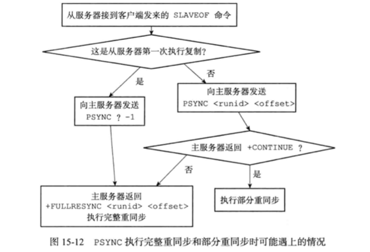

##### 复制的实现
向从服务发送SLAVEOF命令，可以让一个从服务器复制主服务。
例如：向从服务器发送下面的命令，复制地址为127.0.0.1，端口为6379的主服务器的数据。
```
SLAVEOF 127.0.0.1 6379
```
实现步骤如下：
1.在从服务redisServer的设置主服务器的地址masterhost和端口masterport
```
struct redisServer {
    // 主服务器的地址
  char *masterhost;
    // 主服务器的端口
    int masterport;
};
```
2.建立Socket连接
3.发送PING命令
4.身份验证
5.发送端口信息
6.同步
7.命令传播，心跳检测，检测主从服务器的网络连接状态，“辅助实现min-slaves配置选项，检测命令丢失。
### 第16章 哨兵
哨兵系统指的是由一个或多个哨兵实例组成的哨兵系统可以监视任意多个主服务器及属下的所有从服务器，在被监视的主服务器进入下线状态时，自动将某个从服务器升级为主服务器，并且由新的主服务代替旧的主服务器继续处理命令请求。
#####启动哨兵服务器
哨兵服务器本质上搜索一个运行在特殊模式下的Redis服务器，哨兵服务器启动的实现主要分为三步：
1.初始化服务器。与普通Redis服务器不同的是，初始化时不需要通过载入RDB文件或者AOF文件还原数据库状态。下图为哨兵服务器的主要功能：
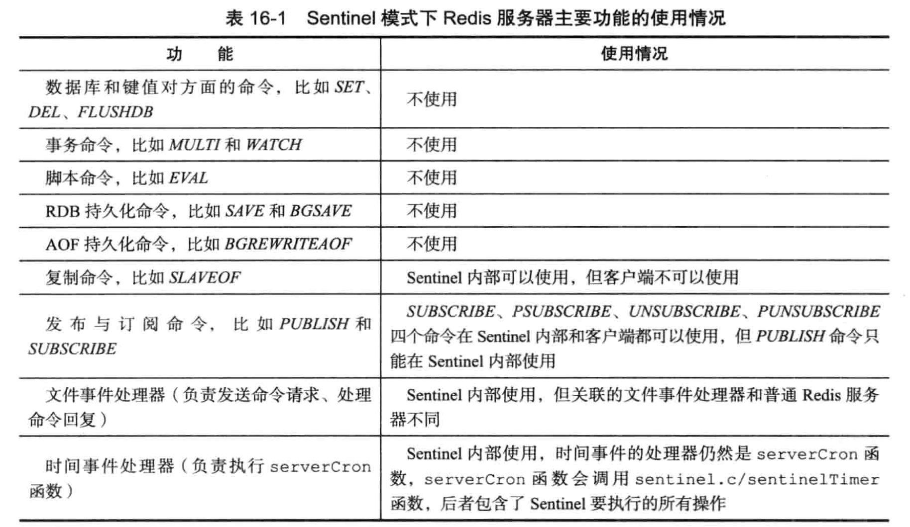
2.使用哨兵专用代码。也就是将一部分普通Redis服务器使用的代码替换为哨兵服务器使用的代码。例如：普通Redis服务器使用redis.c/redisCommandTable作为服务器的命令表，因为SET，SBSIZE等很多命令哨兵服务器不会执行，所以哨兵服务器使用sentinel.c/sentinelcmds作为服务器的命令表，并且其中的INFO命令会使用Sentinel模式下的专用实现sentinel.c/sentinelInfoCommand函数，而不是普通Redis服务器使用的实现redis.c/infoCommand函数。
3.初始化哨兵服务器的状态。普通服务器的一般状态仍然由redis.h/redisServer结构保存，哨兵服务器会初始化一个sentinel.c/sentinelState结构，这个结构保存了服务器中所有和Sentinel功能有关的状态。

```
struct sentinelState {
    // 当前纪元，用于实现故障转移
    uint64_t current_epoch;
    // 保存了所有被这个哨兵服务器监视的主服务器
    // 字典的键是主服务器的名字
    // 字典的值则是一个指向sentinelRedisInstance结构的指针
    dict *masters;
    // 是否进入了TILT模式？
    int tilt;
    // 目前正在执行的脚本的数量
    int running_scripts;
    // 进入TILT模式的时间
    mstime_t tilt_start_time;
    // 最后一次执行时间处理器的时间
    mstime_t previous_time;
    // 一个FIFO队列，包含了所有需要执行的用户脚本
  list *scripts_queue;
} sentinel;
```
保存了被监视的主服务器信息的sentinelRedisInstance结构
```
typedef struct sentinelRedisInstance {
    // 标识值，记录了实例的类型，以及该实例的当前状态
    int flags;
    // 实例的名字
    // 主服务器的名字由用户在配置文件中设置
    // 从服务器以及Sentinel的名字由Sentinel自动设置
    // 格式为ip:port，例如"127.0.0.1:26379"
    char *name;
    // 实例的运行ID
    char *runid;
    // 配置纪元，用于实现故障转移
    uint64_t config_epoch;
    // 实例的地址
    sentinelAddr *addr;
    // SENTINEL down-after-milliseconds选项设定的值
    // 实例无响应多少毫秒之后才会被判断为主观下线（subjectively down）
    mstime_t down_after_period;
    // SENTINEL monitor <master-name> <IP> <port> <quorum>
选项中的quorum参数
    // 判断这个实例为客观下线（objectively down
）所需的支持投票数量
    int quorum;
    // SENTINEL parallel-syncs <master-name> <number>
选项的值
    // 
在执行故障转移操作时，可以同时对新的主服务器进行同步的从服务器数量
    int parallel_syncs;
    // SENTINEL failover-timeout <master-name> <ms>
选项的值
    // 刷新故障迁移状态的最大时限
    mstime_t failover_timeout;
    // ...
} sentinelRedisInstance;
```
4.创建连向主服务器的网络连接。哨兵服务器会创建两个连向被监视的主服务器的异步网络连接，一个命令连接，用于向主服务器发送命令，并接受命令回复。另一个是订阅连接，用于订阅主服务器的__sentinel__:hello频道。通过这个频道，哨兵服务器可以通过主服务器了解其他哨兵服务器，从服务器等信息。
##### 命令连接-获取主服务器信息
哨兵服务器会以每十秒一次的频率，通过命令链接向被监视的主服务器发送INFO命令，并根据回复来获取主服务器的当前信息。
能获取到的信息如下：
1.主服务器的相关信息（运行ID，角色等）
2.主服务器下属的所有从服务器的信息（服务器的角色，IP，端口，在线状态等）
根据这些信息，哨兵对象可以更新自身的sentinelRedisInstance结构中的主服务器和从服务器信息。（可以自动发现从服务器的信息）
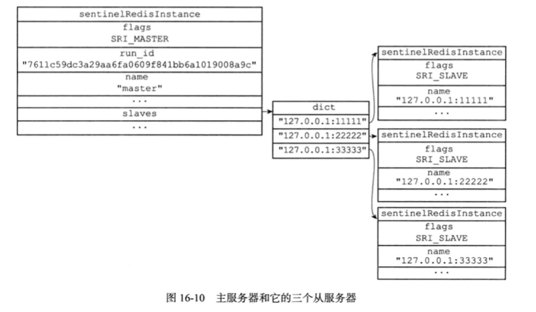

##### 命令连接-获取从服务器的信息
当哨兵对象发现新的从服务器出现时， 会为它创建实例结构，而且会创建连接到从服务器的命令连接和订阅连接。并且会以每十秒一次的频率通过命令连接向从服务器发送INFO命令，获取从服务器及它所属的主服务器的信息。主要获得的信息如下：
从服务器的运行ID，角色role。
主服务器的IP地址，端口号master_port，主从服务器的连接状态，从服务器的优先级slave_priority，从服务器的复制偏移量slave_repl_offset。
下图展示了根据上面的INFO命令回复对从服务器的实例结构进行更新之后的情况：
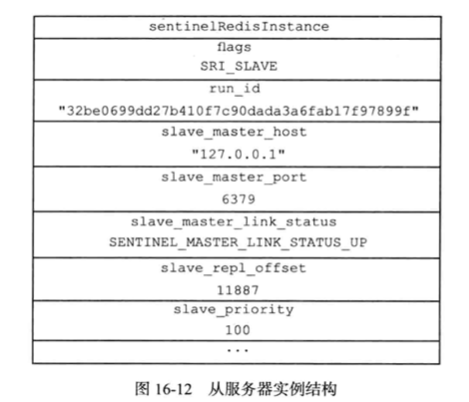

##### 向主服务器和从服务器发送信息
在默认情况下，Sentinel会以每两秒一次的频率，通过命令连接向所有被监视的主服务器和从服务器发送PUBLISH的命令，格式如下：
```
PUBLISH __sentinel__:hello "<s_ip>,<s_port>,<s_runid>,<s_epoch>,<m_name>,<m_ip>,<m_port>,<m_epoch>
```
参数包括哨兵服务器的IP，端口，运行ID，配置纪元。主服务器的名字，IP，端口，配置纪元。
以下是一条Sentinel通过PUBLISH命令向主服务器发送的信息示例：
```
"127.0.0.1,26379,e955b4c85598ef5b5f055bc7ebfd5e828dbed4fa,0,mymaster,127.0.0.1,6379,0
```
这个示例包含了以下信息：
·Sentinel的IP地址为127.0.0.1端口号为26379，运行ID为e955b4c85598ef5b5f055bc7ebfd5e828dbed4fa，当前的配置纪元为0。
·主服务器的名字为mymaster，IP地址为127.0.0.1，端口号为6379，当前的配置纪元为0。
##### 接收来自主服务器和从服务器的频道信息
当Sentinel与一个主服务器或者从服务器建立起订阅连接之后，Sentinel就会通过订阅连接，向服务器发送以下命令：
```
SUBSCRIBE __sentinel__:hello
```
Sentinel对__sentinel__:hello频道的订阅会一直持续到Sentinel与服务器的连接断开为止。对于每个与Sentinel连接的服务器，Sentinel既通过命令连接向服务器的__sentinel__:hello频道发送信息，又通过订阅连接从服务器的__sentinel__:hello频道接收信息。当sentinel1向服务器的__sentinel__:hello频道发送一条信息时，所有订阅了__sentinel__:hello频道的Sentinel（包括sentinel1自己在内）都会收到这条信息，然后对相应主服务器的实例结构进行更新。
##### 更新sentinels字典
Sentinel为主服务器创建的实例结构中的sentinels字典保存了除Sentinel本身之外，还保存了所有同样监视这个主服务器的其他Sentinel的信息。当一个Sentinel收到其他Sentinel发来的信息时，会对消息解析，更新sentinels字典。

·sentinels字典的键是其中一个Sentinel的名字，格式为ip:port，比如对于IP地址为127.0.0.1，端口号为26379的Sentinel来说，这个Sentinel在sentinels字典中的键就是"127.0.0.1:26379"。
·sentinels字典的值则是键所对应Sentinel的实例结构，比如对于键"127.0.0.1:26379"来说，这个键在sentinels字典中的值就是IP为127.0.0.1，端口号为26379的Sentinel的实例结构。
#####“创建连向其他Sentinel的命令连接
当Sentinel通过频道信息发现一个新的Sentinel时，它不仅会为新Sentinel在sentinels字典中创建相应的实例结构，还会创建一个连向新Sentinel的命令连接，而新Sentinel也同样会创建连向这个Sentinel的命令连接，最终监视同一主服务器的多个Sentinel将形成相互连接的网络：Sentinel A有连向Sentinel B的命令连接，而Sentinel B也有连向Sentinel A的命令连接，如下图所示：

Sentinel之间不会创建订阅连接
Sentinel在连接主服务器或者从服务器时，会同时创建命令连接和订阅连接，但是在连接其他Sentinel时，却只会创建命令连接，而不创建订阅连接。因为Sentinel需要通过接收主服务器或者从服务器发来的频道信息来发现未知的新Sentinel，所以才需要建立订阅连接，而相互已知的Sentinel只要使用命令连接来进行通信就足够了。

##### 检测主观下线状态
在默认情况下，Sentinel会以每秒一次的频率向所有与它创建了命令连接的实例（包括主服务器、从服务器、其他Sentinel在内）发送PING命令，并通过实例返回的PING命令回复来判断实例是否在线。
·有效回复：实例返回+PONG、-LOADING、-MASTERDOWN三种回复的其中一种。
·无效回复：实例返回除+PONG、-LOADING、-MASTERDOWN三种回复之外的其他回复，或者在指定时限内没有返回任何回复。
Sentinel配置文件中的down-after-milliseconds选项指定了Sentinel判断实例进入主观下线所需的时间长度：如果一个实例在down-after-milliseconds毫秒内，连续向Sentinel返回无效回复，那么Sentinel会修改这个实例所对应的实例结构，在结构的flags属性中打开SRI_S_DOWN标识，以此来表示这个实例已经进入主观下线状态。
##### 检测客观下线状态
当Sentinel将一个主服务器判断为主观下线之后，为了确认这个主服务器是否真的下线了，它会向同样监视这一主服务器的其他Sentinel发送"SENTINEL is-master-down-by-addr”命令，看它们是否也认为主服务器已经进入了下线状态（可以是主观下线或者客观下线）。当Sentinel从其他Sentinel那里接收到足够数量的已下线判断之后，Sentinel就会将从服务器判定为客观下线，并对主服务器执行故障转移操作。
客观下线状态的判断条件
Sentinel配置中有一个quorum属性，当有quorum个数的Sentinel认为主服务进入下线状态时，Sentinel便将主服务器判定位客户下线。（每个Sentinel的quorum可以不同）。
##### 选举领头Sentinel
当一个主服务器被判断为客观下线时，监视这个下线主服务器的各个Sentinel会进行协商，选举出一个领头Sentinel，并由领头Sentinel对下线主服务器执行故障转移操作。
以下是Redis选举领头Sentinel的规则和方法：
1.每个Sentinel（源Sentinel）向另一个Sentinel（目标Sentinel）发送SENTINEL is-master-down-by-addr命令，要求后者将前者设置为局部领头Sentinel，每个Sentinel设置局部领头Sentinel规则都是先到先得，最先向目标Sentinel发送设置要求的源Sentinel将成为目标Sentinel的局部领头Sentinel，而之后接收到的所有设置要求都会被目标Sentinel拒绝。
2.局部领头一旦设置，目标Sentinel会将配置纪元+1，并且给源Sentinel回复局部领头Sentinel的运行ID和配置纪元。
3.源Sentinel在接收到目标Sentinel返回的命令回复之后，会检查回复中leader_epoch参数的值和自己的配置纪元是否相同，如果相同的话，那么源Sentinel继续取出回复中的leader_runid参数，如果leader_runid参数的值和源Sentinel的运行ID一致，那么表示目标Sentinel将源Sentinel设置成了局部领头Sentinel。
4.如果有某个Sentinel被半数以上的Sentinel设置成了局部领头Sentinel，那么这个Sentinel成为领头Sentinel。
5.如果在给定时限内，没有一个Sentinel被选举为领头Sentinel，那么各个Sentinel将在一段时间之后再次进行选举，直到选出领头Sentinel为止。
##### 故障转移
在选举产生出领头Sentinel之后，领头Sentinel将对已下线的主服务器执行故障转移操作，该操作包含以下三个步骤：
1.在已下线主服务器属下的所有从服务器里面，挑选出一个从服务器，并将其转换为主服务器。
挑选规则:
1）删除列表中所有处于下线或者断线状态的从服务器
2）删除列表中所有最近五秒内没有回复过领头Sentinel的INFO命令的从服务器
3）删除所有与已下线主服务器连接断开超过down-after-milliseconds*10毫秒的从服务器：down-after-milliseconds选项指定了判断主服务器下线所需的时间，而删除断开时长超过down-after-milliseconds*10毫秒的从服务器，则可以保证列表中剩余的从服务器都没有过早地与主服务器断开连接，换句话说，列表中剩余的从服务器保存的数据都是比较新的。
之后，领头Sentinel将根据从服务器的优先级，对列表中剩余的从服务器进行排序，并选出其中优先级最高的从服务器。
2.领头Sentinel向从服务器发送SLAVEOF命令，让已下线主服务器属下的所有从服务器改为复制新的主服务器。
3.当这个旧的主服务器重新上线时，领头Sentinel向它发送SLAVEOF命令将已下线主服务器设置为新的主服务器的从服务器。
### 第17章 集群
Redis集群是一个分布式数据库方案，可以通过分片来进行数据共享，并提供复制和故障转移功能。
##### 节点
节点只是一个运行在集群模式下的Redis服务器，由启动时配置中的cluster-enabled属性决定。
##### 集群数据结构
使用clusterNode结构可以保存了一个节点的当前状态，例如创建时间，名字，配置纪元，IP，端口等。
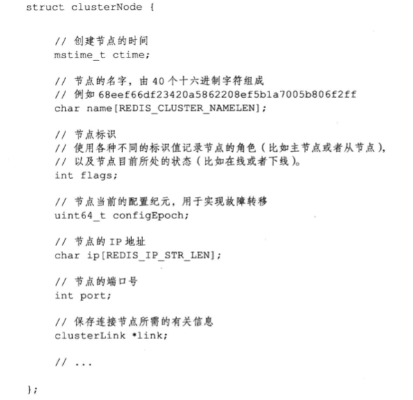
clusterNode结构的link属性是一个clusterLink结构，该结构保存了连接节点所需的有关信息，比如套接字描述符，输入缓冲区和输出缓冲区等。（有点类似于redisClient结构中用于连接客户端的套接字，缓冲区）

每个节点都保存着一个clusterState结构，这个结构记录了在当前节点的视角下，集群目前所处的状态，例如集群是在线还是下线，集群包含多少个节点，集群当前的配置纪元等。
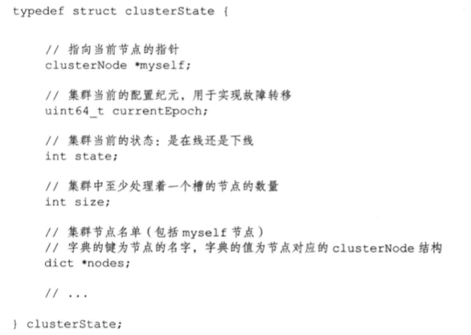

#####槽指派
Redis集群通过分片的方式来保存数据库中的键值对：集群的整个数据库被分为16384个槽（slot），分配给每个节点处理，数据库中的每个键都属于这16384个槽的其中一个。可以使用CLUSTER MEET命令对槽进行分配。
clusterNode结构中的slots属性和numslot属性记录了节点处理哪些槽，numslot属性记录了当前节点处理的槽的数量，slots属性是一个二进制位数组，一共有16384位，数组第i位上的值代表节点是否处理槽i。
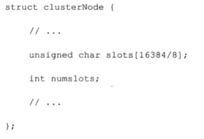
下图展示了一个slots数组示例：这个数组索引0至索引7上的二进制位的值都为1，其余所有二进制位的值都为0，这表示节点负责处理槽0至槽7。


##### 记录集群所有槽的指派信息
除了记录自身节点负责的槽位信息以外，clusterState结构中的slots数组记录了集群中所有16384个槽的指派信息。
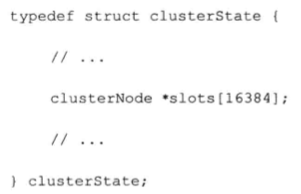
slots数组包含16384个项，每个数组项都是一个指向对应的槽所在的clusterNode结构的指针，如果slots[i]指针指向NULL，那么表示槽i尚未指派给任何节点。
clusterNode.slots 与 clusterState.slots
如果只有clusterNode.slots ，想要知道某个槽被指派给哪个节点，需要以O（N）的复杂度对clusterState.Nodes字典中每个节点的slots数组进行遍历，而通过clusterState.slots查找只需要O（1）复杂度。
如果只有clusterState.slots ，想要将某个节点的槽指派信息发送给其他节点，需要以O（N）的复杂度对clusterState.slots数组进行遍历，而通过clusterState.slots可以直接发送。

#####在集群中执行命令
在对数据库中的16384个槽都进行了指派之后，集群就会进入上线状态，这时客户端就可以向集群中的节点发送数据命令了。
当客户端向节点发送与数据库键有关的命令时，接收命令的节点会计算出命令要处理的数据库键属于哪个槽，并检查这个槽所在的节点，如果键所在的槽正好就指派给了当前节点，那么节点直接执行这个命令。如果键所在的槽并没有指派给当前节点，那么节点会向客户端返回一个MOVED错误，指引客户端转向（redirect）至正确的节点，并客户端会向正确的节点再次发送之前想要执行的命令，并且之后这个槽的对应的键也会直接往正确的节点发送。
#####“计算键属于哪个槽
节点使用以下算法来计算给定键key属于哪个槽
```
def slot_number(key):
    return CRC16(key) & 16383
```
其中CRC16（key）语句用于计算键key的CRC-16校验和，而&16383语句则用于计算出一个介于0至16383之间的整数作为键key的槽号。
#####“节点数据库的实现
集群节点保存键值对以及键值对过期时间的方式，与的单机Redis服务器保存键值对以及键值对过期时间的方式完全相同。节点和单机服务器在数据库方面的一个区别是，节点只能使用0号数据库。
下图展示了节点7000的数据库状态，数据库中包含列表键"lst"，哈希键"book"，以及字符串键"date"，其中键"lst"和键"book"带有过期时间。
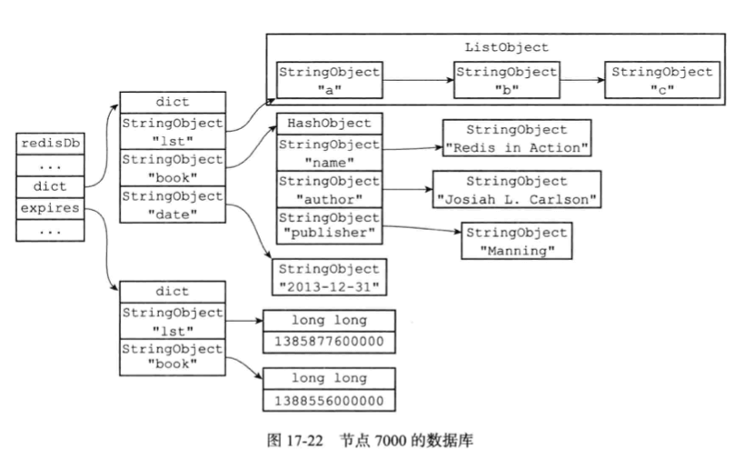
除了将键值对保存在数据库里面之外，节点还会用clusterState结构中的slots_to_keys跳跃表来保存槽和键之间的关系。slots_to_keys跳跃表每个节点的分值保存键对应的槽位，每个节点的成员都是一个数据库键，如下图所示：
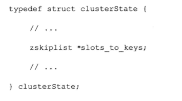
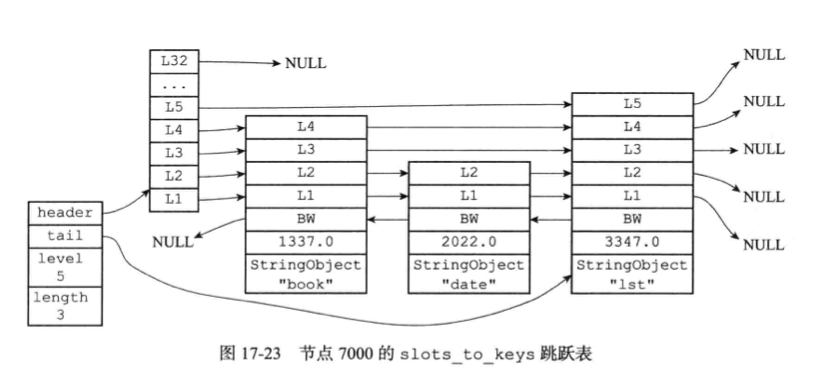

##### 重新分片
Redis集群的重新分片操作可以将任意数量已经指派给某个节点（源节点）的槽改为指派给另一个节点（目标节点），并且相关槽所属的键值对也会从源节点被移动到目标节点。
重新分片操作可以在线（online）进行，在重新分片的过程中，集群不需要下线，并且源节点和目标节点都可以继续处理命令请求。
“重新分片的实现原理
Redis集群的重新分片操作是由Redis的集群管理软件redis-trib负责执行的，Redis提供了进行重新分片所需的所有命令，而redis-trib则通过向源节点和目标节点发送命令来进行重新分片操作。
redis-trib对集群的单个槽slot进行重新分片的步骤如下：
1）redis-trib对目标节点发送CLUSTER SETSLOT<slot>IMPORTING<source_id>命令，让目标节点准备好从源节点导入（import）属于槽slot的键值对。
2）redis-trib对源节点发送CLUSTER SETSLOT<slot>MIGRATING<target_id>命令，让源节点准备好将属于槽slot的键值对迁移（migrate）至目标节点。
3）redis-trib向源节点发送CLUSTER GETKEYSINSLOT<slot><count>命令，获得最多count个属于槽slot的键值对的键名（key name）。
“重新分片的实现原理
Redis集群的重新分片操作是由Redis的集群管理软件redis-trib负责执行的，Redis提供了进行重新分片所需的所有命令，而redis-trib则通过向源节点和目标节点发送命令来进行重新分片操作。
redis-trib对集群的单个槽slot进行重新分片的步骤如下：
1）redis-trib对目标节点发送CLUSTER SETSLOT<slot>IMPORTING<source_id>命令，让目标节点准备好从源节点导入（import）属于槽slot的键值对。
2）redis-trib对源节点发送CLUSTER SETSLOT<slot>MIGRATING<target_id>命令，让源节点准备好将属于槽slot的键值对迁移（migrate）至目标节点。
3）redis-trib向源节点发送CLUSTER GETKEYSINSLOT<slot><count>命令，获得最多count个属于槽slot的键值对的键名（key name）。
4）对于步骤3获得的每个键名，redis-trib都向源节点发送一个MIGRATE<target_ip><target_port><key_name>0<timeout>命令，将被选中的键原子地从源节点迁移至目标节点。
5）重复执行步骤3和步骤4，直到源节点保存的所有属于槽slot的键值对都被迁移至目标节点为止。每次迁移键的过程如图17-24所示。
6）redis-trib向集群中的任意一个节点发送CLUSTER SETSLOT<slot>NODE<target_id>命令，将槽slot指派给目标节点，这一指派信息会通过消息发送至整个集群，最终集群中的所有节点都会知道槽slot已经指派给了目标节点。


#####槽迁移相关

```
typedef struct clusterState {
  clusterNode *importing_slots_from[16384];
  clusterNode *migrating_slots_to[16384];
} clusterState;
```
clusterState结构的importing_slots_from数组记录了当前节点正在从其他节点导入的槽,如果importing_slots_from[i]的值不为NULL，而是指向一个clusterNode结构，那么表示当前节点正在从clusterNode所代表的节点导入槽i。同理migrating_slots_to数组记录了当前节点正在导出到其他节点的槽。
当对集群进行重新分片时，源节点会对migrating_slots_to数组进行更新，目标节点会对importing_slots_from数组进行更新。

#####ASK错误
在进行重新分片期间，源节点向目标节点迁移一个槽的过程中，可能会出现这样一种情况：属于被迁移槽的一部分键值对保存在源节点里面，而另一部分键值对则保存在目标节点里面。
当客户端向源节点发送一个与数据库键有关的命令，并且命令要处理的数据库键恰好就属于正在被迁移的槽时：
·源节点会先在自己的数据库里面查找指定的键，如果找到的话，就直接执行客户端发送的命令。
·相反地，如果源节点没能在自己的数据库里面找到指定的键，那么这个键有可能已经被迁移到了目标节点，源节点将向客户端返回一个ASK错误，指引客户端转向正在导入槽的目标节点，在向目标节点发送之前想要执行的命令之前，需要先发送ASKING命令，将客户端的REDIS_ASKING标识打开，否则目标节点不会对正在迁移的槽执行相关的命令。（客户端的REDIS_ASKING标识是一个一次性标识，当节点执行了一个带有REDIS_ASKING标识的客户端发送的命令之后，客户端的REDIS_ASKING标识就会被移除。）
ASK
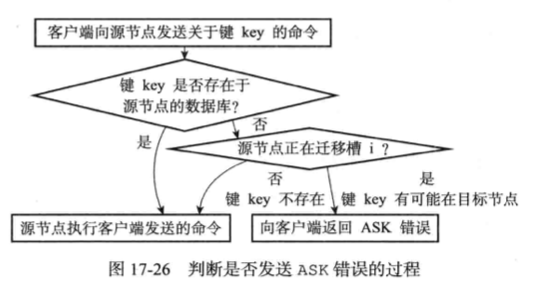
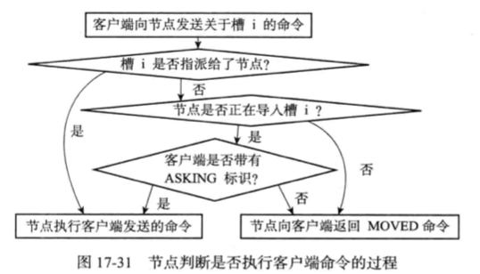

#####ASK错误和MOVED错误的区别
ASK错误和MOVED错误都会导致客户端转向，它们的区别在于：
·MOVED错误代表槽的负责权已经从一个节点转移到了另一个节点：在客户端收到关于槽i的MOVED错误之后，客户端每次遇到关于槽i的命令请求时，都可以直接将命令请求发送至MOVED错误所指向的节点，因为该节点就是目前负责槽i的节点。
·与此相反，ASK错误只是两个节点在迁移槽的过程中使用的一种临时措施：在客户端收到关于槽i的ASK错误之后，客户端只会在接下来的一次命令请求中将关于槽i的命令请求发送至ASK错误所指示的节点，但这种转向不会对客户端今后发送关于槽i的命令请求产生任何影响，客户端仍然会将关于槽i的命令请求发送至目前负责处理槽i的节点，除非ASK错误再次出现。
#####复制和故障转移
Redis集群中的节点分为主节点（master）和从节点（slave），其中主节点用于处理槽，而从节点则用于复制某个主节点，并在被复制的主节点下线时，代替下线主节点继续处理命令请求。
##### 故障检测
集群中的每个节点都会定期地向集群中的其他节点发送PING消息，以此来检测对方是否在线，如果接收PING消息的节点没有在规定的时间内，向发送PING消息的节点返回PONG消息，那么发送PING消息的节点就会将接收PING消息的节点标记为疑似下线（probable fail，PFAIL）。
集群中的各个节点会通过互相发送消息的方式来交换集群中各个节点的状态信息，例如某个节点是处于在线状态、疑似下线状态（PFAIL），还是已下线状态。
一个主节点A通过消息得知主节点B认为主节点C进入了疑似下线状态时，主节点A会在自己的clusterState.nodes字典中找到主节点C所对应的clusterNode结构，并将主节点B的下线报告（failure report）添加到clusterNode结构的fail_reports链表里面
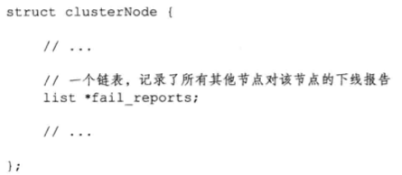

#####故障转移
当一个从节点发现自己正在复制的主节点进入了已下线状态时，从节点将开始对下线主节点进行故障转移，以下是故障转移的执行步骤：
1）复制下线主节点的所有从节点里面，会有一个从节点被选中。
2）被选中的从节点会执行SLAVEOF no one命令，成为新的主节点。
3）新的主节点会撤销所有对已下线主节点的槽指派，并将这些槽全部指派给自己。
4）新的主节点向集群广播一条PONG消息，这条PONG消息可以让集群中的其他节点立即知道这个节点已经由从节点变成了主节点，并且这个主节点已经接管了原本由已下线节点负责处理的槽。
5）新的主节点开始接收和自己负责处理的槽有关的命令请求，故障转移完成。
#####选举新的主节点
新的主节点是通过选举产生的，这个选举新主节点的方法和第16章介绍的选举领头Sentinel的方法非常相似，因为两者都是基于Raft算法的领头选举（leader election）方法来实现的。
以下是集群选举新的主节点的方法：
1）集群的配置纪元是一个自增计数器，它的初始值为0。
2）当集群里的某个节点开始一次故障转移操作时，集群配置纪元的值会被增一。
3）对于每个配置纪元，集群里每个负责处理槽的主节点都有一次投票的机会，而第一个向主节点要求投票的从节点将获得主节点的投票。
4）当从节点发现自己正在复制的主节点进入已下线状态时，从节点会向集群广播一条CLUSTERMSG_TYPE_FAILOVER_AUTH_REQUEST消息，要求所有收到这条消息、并且具有投票权的主节点向这个从节点投票。
5）“如果一个主节点具有投票权（它正在负责处理槽），并且这个主节点尚未投票给其他从节点，那么主节点将向要求投票的从节点返回一条CLUSTERMSG_TYPE_FAILOVER_AUTH_ACK消息，表示这个主节点支持从节点成为新的主节点。
6）每个参与选举的从节点都会接收CLUSTERMSG_TYPE_FAILOVER_AUTH_ACK消息，并根据自己收到了多少条这种消息来统计自己获得了多少主节点的支持。
7）如果集群里有N个具有投票权的主节点，那么当一个从节点收集到大于等于N/2+1张支持票时，这个从节点就会当选为新的主节点。
8）因为在每一个配置纪元里面，每个具有投票权的主节点只能投一次票，所以如果有N个主节点进行投票，那么具有大于等于N/2+1张支持票的从节点只会有一个，这确保了新的主节点只会有一个。
9）如果在一个配置纪元里面没有从节点能收集到足够多的支持票，那么集群进入一个新的配置纪元，并再次进行选举，直到选出新的主节点为止。
#####消息
集群中的各个节点通过发送和接收消息（message）来进行通信，
节点发送的消息主要有以下五种：
·MEET消息：
当发送者接到客户端发送的CLUSTER MEET命令时，发送者会向接收者发送MEET消息，请求接收者加入到发送者当前所处的集群里面。
PING消息
集群里的每个节点默认每隔一秒钟就会从已知节点列表中随机选出五个节点，然后对这五个节点中最长时间没有发送过PING消息的节点发送PING消息，以此来检测被选中的节点是否在线。除此之外，如果节点A最后一次收到节点B发送的PONG消息的时间，“距离当前时间已经超过了节点A的cluster-node-timeout选项设置时长的一半，那么节点A也会向节点B发送PING消息，这可以防止节点A因为长时间没有随机选中节点B作为PING消息的发送对象而导致对节点B的信息更新滞后。
PONG消息
当接收者收到发送者发来的MEET消息或者PING消息时，为了向发送者确认这条MEET消息或者PING消息已到达，接收者会向发送者返回一条PONG消息。另外，一个节点也可以通过向集群广播自己的PONG消息来让集群中的其他节点立即刷新关于这个节点的认识，例如当一次故障转移操作成功执行之后，新的主节点会向集群广播一条PONG“消息，以此来让集群中的其他节点立即知道这个节点已经变成了主节点，并且接管了已下线节点负责的槽。
FAIL消息
当一个主节点A判断另一个主节点B已经进入FAIL状态时，节点A会向集群广播一条关于节点B的FAIL消息，所有收到这条消息的节点都会立即将节点B标记为已下线。
PUBLISH消息
当节点接收到一个PUBLISH命令时，节点会执行这个命令，并向集群广播一条PUBLISH消息，所有接收到这条PUBLISH消息的节点都会执行相同的PUBLISH命令。
### 第 18 章 发布与订阅
在Redis中，客户端可以订阅一个或多个频道，之后其他客户端往这个频道发送消息时，所有订阅者都可以收到这条消息。
SUBSCRIBE订阅一个频道。
PSUBSCRIBE是订阅一个符合规则的一个或多个频道。
PUBLISH是往频道发布一条消息。
#####频道的订阅与退订
当一个客户端执行SUBSCRIBE命令订阅某个或某些频道的时，
Redis将所有频道的订阅关系都保存在redisServer的pubsub_channels字典里面，这个字典的键是某个被订阅的频道，而键的值则是一个链表，链表里面记录了所有订阅这个频道的客户端，如下图所示
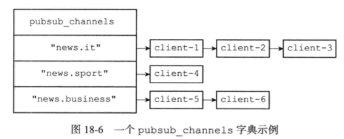
·client-1、client-2、client-3三个客户端正在订阅"news.it"频道。
·客户端client-4正在订阅"news.sport"频道。
·client-5和client-6两个客户端正在订阅"news.business"频道。
退订频道
UNSUBSCRIBE命令的行为和SUBSCRIBE命令的行为正好相反，当一个客户端退订某个或某些频道的时候，服务器将在pubsub_channels字典中找到频道对应的订阅者链表，然后从订阅者链表中删除退订客户端的信息。

##### 模式的订阅与退订
服务器将所有频道的订阅关系都保存在服务器状态的pubsub_channels属性里面，与此类似，服务器也将所有模式的订阅关系都保存在服务器状态的pubsub_patterns属性里面，pubsub_patterns属性是一个链表，链表中的每个节点都包含着一个pubsub Pattern结构，这个结构的pattern属性记录了被订阅的模式，而client属性则记录了订阅模式的客户端。
如下图所示：

展示了一个pubsub_patterns链表示例，这个链表记录了以下信息：
·客户端client-7正在订阅模式"music.*"。
·客户端client-8正在订阅模式"book.*"。
·客户端client-9正在订阅模式"news.*"。
退订模式
模式的退订命令PUNSUBSCRIBE是PSUBSCRIBE命令的反操作：当一个客户端退订某个或某些模式的时候，服务器将在pubsub_patterns链表中查找并删除那些pattern属性为被退订模式，并且client属性为执行退订命令的客户端的pubsubPattern结构。
发送消息
当一个Redis客户端执行PUBLISH<channel><message>命令将消息message发送给频道channel的时候，服务器需要执行以下两个动作：
1）将消息message发送给channel频道的所有订阅者。
2）如果有一个或多个模式pattern与频道channel相匹配，那么将消息message发送给pattern模式的订阅者。
将消息发送给频道订阅者
因为服务器状态中的pubsub_channels字典记录了所有频道的订阅关系，所以为了将消息发送给channel频道的所有订阅者，PUBLISH命令要做的就是在pubsub_channels字典里找到频道channel的订阅者名单（一个链表），然后将消息发送给名单上的所有客户端。

##### 查看订阅信息
PUBSUB命令是Redis 2.8新增加的命令之一，客户端可以通过这个命令来查看频道或者模式的相关信息，比如某个频道目前有多少订阅者，又或者某个模式目前有多少订阅者。
PUBSUB CHANNELS[pattern]
这个命令用于返回服务器当前被订阅的频道（如果没有pattern参数，那么命令返回服务器当前被订阅的所有频道）
PUBSUB NUMSUB
PUBSUB NUMSUB[channel-1 channel-2...channel-n]子命令接受任意多个频道作为输入参数，并返回这些频道的订阅者数量。
PUBSUB NUMPAT
PUBSUB NUMPAT子命令用于返回服务器当前被订阅模式的数量。
这个子命令是通过返回pubsub_patterns链表的长度来实现的，因为这个链表的长度就是服务器中，使用订阅模式订阅频道的客户端的数量。
##### 第19章 事务
Redis可以使用事务来将多个命令打包成一条命令，然后一次性，按顺序地在服务端执行，在事务执行期间，服务器不会中断事务去执行其他客户端的命令请求。
以下是一个事务执行的过程，该事务首先以一个MULTI命令为开始，接着将多个命令放入事务当中，最后由EXEC命令将这个事务提交（commit）给服务器执行：
```
redis> MULTI
OK
redis> SET "name" "Practical Common Lisp"
QUEUED
redis> GET "name"
QUEUED
redis> SET "author" "Peter Seibel"
QUEUED
redis> GET "author"
QUEUED
redis> EXEC
1) OK
2) "Practical Common Lisp"
3) OK
4) "Peter Seibel
```
####事务的实现
#####事务的开始
MULTI命令的执行标志着事务的开始，MULTI命令可以将执行该命令的客户端从非事务状态切换至事务状态，这一切换是通过改变redisClient的flags属性中的REDIS_MULTI标识来完成的。
#####命令入队
当一个客户端处于非事务状态时，这个客户端发送的命令会立即被当一个客户端切换到事务状态之后，服务器会根据这个客户端发来的不同命令执行不同的操作：
·如果客户端发送的命令为EXEC、DISCARD、WATCH、MULTI四个命令的其中一个，那么服务器立即执行这个命令。
·与此相反，如果客户端发送的命令是EXEC、DISCARD、WATCH、MULTI四个命令以外的其他命令，那么服务器并不立即执行这个命令，而是将这个命令放入一个事务队列里面，然后向客户端返回QUEUED回复。
服务器判断命令是该入队还是该立即执行的过程如下图所示：
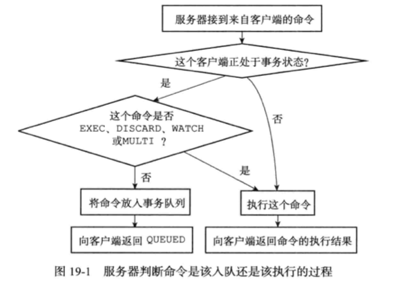

#####事务队列
redisClient中保存了自己的事务状态，这个事务状态保存在客户端状态的mstate属性里面：
```
typedef struct redisClient {
//事务状态
  multiState mstate;    /* MULTI/EXEC state */
  // ...
} redisClient;
//事务状态包含一个事务队列，以及一个已入队命令的计数器（也可以说是事务队列的长度）
typedef struct multiState {
  // 事务队列，FIFO顺序
  multiCmd *commands;
  // 已入队命令计数
  int count; 
} multiState;
//事务队列是一个multiCmd类型的数组，数组中的每个multiCmd结构都保存了一个已入队命令的相关信息，包括指向命令实现函数的指针、命令的参数，以及参数的数量：
typedef struct multiCmd { 
  // 参数
  robj **argv;
 // 参数数量
  int argc;
  // 命令指针
  struct redisCommand *cmd;
} multiCmd;
```
事务队列以先进先出（FIFO）的方式保存入队的命令，较先入队的命令会被放到数组的前面，而较后入队的命令则会被放到数组的后面。
#####执行事务
当一个处于事务状态的客户端向服务器发送EXEC命令时，这个EXEC命令将立即被服务器执行。服务器会遍历这个客户端的事务队列，执行队列中保存的所有命令，最后将执行命令所得的结果全部返回给客户端。
#####WATCH命令的实现
WATCH命令是一个乐观锁（optimistic locking），它可以在EXEC命令执行之前，监视任意数量的数据库键，并在EXEC命令执行时，检查被监视的键是否至少有一个已经被修改过了，如果是的话，服务器将拒绝执行事务，并向客户端返回代表事务执行失败的空回复。
乐观锁与悲观锁
悲观锁就是假定最坏的情况，每次取数据时，都假设数据会被修改，所以取数据时都进行加锁，这样其他线程取数据时就会阻塞，直到获取到锁，然后取数据。java中的synchronized和ReentrantLock等独占锁就是悲观锁思想的实现。
乐观锁就是假定最好的情景，每次取数据时，都假设数据不会被修改，只有真正修改数据时会判断之前取到的值与变量当前在内存中的值是否一致，只有一致时才进行更新，否则就不更新。一般通过版本号或者CAS算法实现（CAS算法就是当且仅当当前内存中的的值等于预期值时，CAS通过原子方式用新值来更新内存中的值，否则不会执行任何操作（比较和替换是一个原子操作）。一般情况下是一个自旋操作，即不断的重试）
乐观锁适合写比较少的场景，悲观锁适合写比较多的场景。
乐观锁的缺点
1.ABA问题，就是变量先被改成B值，然后改成A值，JDK1.5的AtomicStampedReference的compareAndSet会判断对象的引用是否相同，相同才进行更新。
2. 循环时间长开销大，执行不成功会一直重试，长时间执行会给CPU带来压力
3.只能保证一个共享变量的原子操作,多个共享变量时 CAS 无效。但是JDK 1.5以后，提供了AtomicReference类来保证了引用对象之间的原子性，可以将多个变量放在同一个对象中，来保证原子性。
#####使用WATCH命令监视数据库键
每个Redis数据库都保存着一个watched_keys字典，这个字典的键是某个被WATCH命令监视的数据库键，而字典的值则是一个链表，链表中记录了所有监视相应数据库键的客户端。
```
typedef struct redisDb {
  // 正在被WATCH命令监视的键
  dict *watched_keys;
} redisDb;
```
下图是一个watched_keys字典的示例，从这个watched_keys字典中可以看出：
·客户端c1和c2正在监视键"name"。
·客户端c3正在监视键"age"。
·客户端c2和c4正在监视键"address"。
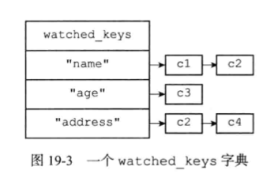

##### 监视机制的触发
所有对数据库进行修改的命令，比如SET、LPUSH、SADD、ZREM、DEL、FLUSHDB等等，在执行之后都会调用multi.c/touchWatchKey函数对watched_keys字典进行检查，查看是否有客户端正在监视刚刚被命令修改过的数据库键，如果有的话，那么touchWatchKey函数会将监视被修改键的客户端的REDIS_DIRTY_CAS标识打开，表示该客户端的事务安全性已经被破坏。
##### 判断事务是否安全
当服务器接收到一个客户端发来的EXEC命令时，服务器会根据这个客户端是否打开了REDIS_DIRTY_CAS标识来决定是否执行事务：
·如果客户端的REDIS_DIRTY_CAS标识已经被打开，那么说明客户端所监视的键当中，至少有一个键已经被修改过了，在这种情况下，客户端提交的事务已经不再安全，所以服务器会拒绝执行客户端提交的事务，否则服务器将执行客户端提交的事务。
#####事务的ACID性质
在传统的关系式数据库中，常常用ACID性质来检验事务功能的可靠性和安全性。在Redis中，事务总是具有原子性（Atomicity）、一致性（Consistency）和隔离性（Isolation），并且当Redis运行在某种特定的持久化模式下时，事务也具有耐久性（Durability）。
##### 原子性
事务具有原子性指的是，数据库将事务中的多个操作当作一个整体来执行，服务器要么就执行事务中的所有操作，要么就一个操作也不执行。
对于Redis的事务功能来说，事务队列中的命令要么就全部都执行，要么就一个都不执行，因此，Redis的事务是具有原子性的。
Redis的事务和传统的关系型数据库事务的最大区别在于，Redis不支持事务回滚机制（rollback），即使事务队列中的某个命令在执行期间出现了错误，整个事务也会继续执行下去，直到将事务队列中的所有命令都执行完毕为止。（原书作者认为，Redis事务的执行时错误通常都是编程错误产生的，所以没必要）
##### 一致性
事务具有一致性指的是，如果数据库在执行事务之前是一致的，那么在事务执行之后，无论事务是否执行成功，数据库也应该仍然是一致的。Redis事务的一致性主要在于解决一些错误，防止事务执行破坏数据库。例如入队错误，执行错误，服务器停机。
服务器停机
如果Redis服务器在执行事务的过程中停机，那么根据服务器所使用的持久化模式，可能有以下情况出现：
·如果服务器运行在无持久化的内存模式下，那么重启之后的数据库将是空白的，因此数据总是一致的。
·如果服务器运行在RDB模式下，那么在事务中途停机不会导致不一致性，因为服务器可以根据现有的RDB文件来恢复数据，从而将数据库还原到一个一致的状态。如果找不到可供使用的RDB文件，那么重启之后的数据库将是空白的，而空白数据库总是一致的。
·如果服务器运行在AOF模式下，那么在事务中途停机不会导致不一致性，因为服务器可以根据现有的AOF文件来恢复数据，从而将数据库还原到一个一致的状态。如果找不到可供使用的AOF文件，那么重启之后的数据库将是空白的，而空白数据库总是一致的。
综上所述，无论Redis服务器运行在哪种持久化模式下，事务执行中途发生的停机都不会影响。 
##### 隔离性
事务的隔离性指的是，即使数据库中有多个事务并发地执行，各个事务之间也不会互相影响，并且在并发状态下执行的事务和串行执行的事务产生的结果完全相同。
因为Redis使用单线程的方式来执行事务（以及事务队列中的命令），并且服务器保证，在执行事务期间不会对事务进行中断，因此，Redis的事务总是以串行的方式运行的，并且事务也总是具有隔离性的。
##### 耐久性
事务的耐久性指的是，当一个事务执行完毕时，执行这个事务所得的结果已经被保存到永久性存储介质（比如硬盘）里面了，即使服务器在事务执行完毕之后停机，执行事务所得的结果也不会丢失。
### 第 21 章 排序
在Redis中使用SORT命令可以对列表键、集合键或者有序集合键的值进行排序。
##### SORT命令的实现
SORT命令为每个被排序的键都创建一个与键长度相同的数组，数组的每个项都是一个redisSortObject结构，obj指针会指向列表或集合中的单个元素，score代表分值，根据score来对数组进行排序（因为涉及到字符串的排序及其他复杂情况，所以才单独使用score存储分值，而不是直接取元素的值）
以下是redisSortObject结构的完整定义：
 ```
typedef struct _redisSortObject {
    // 被排序键的值
    robj *obj;
    // 权重
   union {
        // 排序数字值时使用
        double score;
        // 排序带有BY选项的字符串值时使用
        robj *cmpobj;
    } u;
} redisSortObject;
 ```
服务器执行SORT命令的步骤：
1）创建一个和numbers列表长度相同的数组，该数组的每个项都是一个redis.h/redisSortObject结构，如图所示
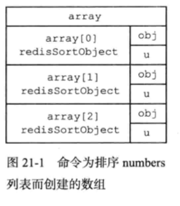

2）遍历数组，将各个数组项的obj指针分别指向numbers列表的各个项，构成obj指针和列表项之间的一对一关系，如图21-2所示。


3）遍历数组，将各个obj指针所指向的列表项转换成一个double类型的浮点数，并将这个浮点数保存在相应数组项的u.score属性里面，如图所示。
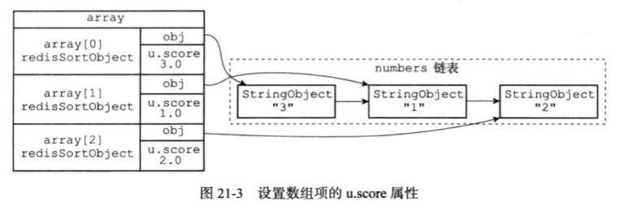
4）根据数组项u.score属性的值，对数组进行数字值排序，排序后的数组项按u.score属性的值从小到大排列，如图所示。
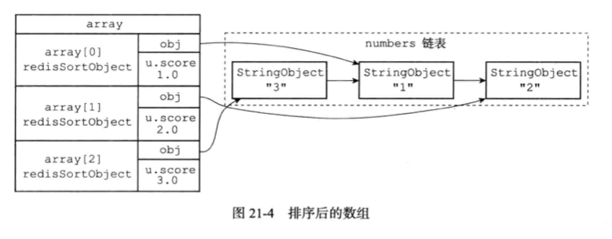
5）遍历数组，将各个数组项的obj指针所指向的列表项作为排序结果返回给客户端，程序首先访问数组的索引0，返回u.score值为1.0的列表项"1"；然后访问数组的索引1，返回u.score值为2.0的列表项"2"；最后访问数组的索引2，返回u.score值为3.0的列表项"3"。

##### ALPHA选项的实现
通过使用ALPHA选项，SORT命令可以对包含字符串值的键进行排序，会根据字母表的顺序来对键进行排序。
##### ASC选项和DESC选项的实现
在默认情况下，SORT命令执行ASC升序排序，排序后的结果按值的大小从小到大排列。ASC升序排序和DESC降序排序都由相同的快速排序算法执行，它们之间的不同之处在于：
·在执行升序排序时，排序算法使用的对比函数产生升序对比结果。
·而在执行降序排序时，排序算法所使用的对比函数产生降序对比结果。
##### BY选项的实现
通过使用BY选项，SORT命令可以指定某些字符串键，或者某个哈希键所包含的某些域（field）来作为元素的权重，对一个键进行排序。
以下这个例子就使用苹果、香蕉、樱桃三种水果的价钱，对集合键fruits进行了排序，排序时会根据BY选项所给定的模式*-price，查找相应的权重键，例如对于"apple"元素，查找程序返回权重键"apple-price"。
```
redis> MSET apple-price 8 banana-price 5.5 cherry-price 7
OK
redis> SORT fruits BY *-price
1) "banana"
2) "cherry"
3) "apple”
```
#####LIMIT选项的实现
可以通过LIMIT选项，我们可以让SORT命令只返回其中一部分已排序的元素。
LIMIT选项的格式为LIMIT<offset><count>：
·offset参数表示要跳过的已排序元素数量。
·count参数表示跳过给定数量的已排序元素之后，要返回的已排序元素数量。
##### GET选项的实现
通过使用GET选项，我们可以让SORT命令在对键进行排序之后，根据被排序的元素，以及GET选项所指定的模式，查找并返回其他键的值。 
#####STORE选项的实现
在默认情况下，SORT命令只向客户端返回排序结果，而不保存排序结果：
```
redis> SADD students "peter" "jack" "tom"
(integer) 3
redis> SORT students ALPHA
1) "jack"
2) "peter"
3) "tom"
```
但是，通过使用STORE选项，我们可以将排序结果保存在指定的键里面，并在有需要时重用这个排序结果。
#####选项的执行顺序
如果按照选项来划分的话，一个SORT命令的执行过程可以分为以下四步：
1）排序：在这一步，命令会使用ALPHA、ASC或DESC、BY这几个选项，对输入键进行排序，并得到一个排序结果集。
2）限制排序结果集的长度：在这一步，命令会使用LIMIT选项，对排序结果集的长度进行限制，只有LIMIT选项指定的那部分元素会被保留在排序结果集中。
3）获取外部键：在这一步，命令会使用GET选项，根据排序结果集中的元素，以及GET选项指定的模式，查找并获取指定键的值，并用这些值来作为新的排序结果集。
4）保存排序结果集：在这一步，命令会使用STORE选项，将排序结果集保存到指定的键上面去。
5）向客户端返回排序结果集：在最后这一步，命令遍历排序结果集，并依次向客户端返回排序结果集中的元素。
### 第 22 章 二进制位数组
位数组是一个数组，数组元素是一个二进制位，在Redis中可以使用字符串对象来代表二进制位数组，字符串对象是一个SDS结构，SDS结构的buf是一个char数组，数组的每一位是一个char字符，每个char字符是8位。
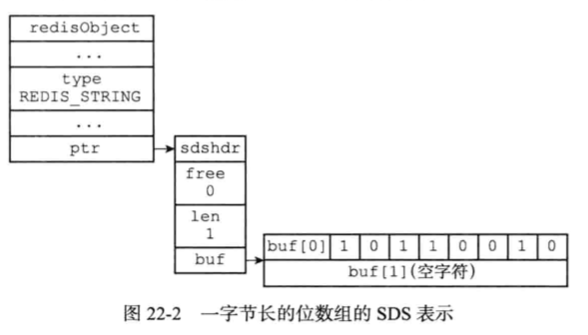

#####GETBIT命令的实现
GETBIT命令用于返回位数组bitarray在offset偏移量上的二进制位的值。
GETBIT命令的执行过程如下：
1）计算byte= offset÷8」，byte值记录了offset偏移量指定的二进制位保存在位数组的哪个字节。
2）计算bit=（offset mod 8）+1，bit值记录了offset偏移量指定的二进制位是byte字节的第几个二进制位。
3）根据byte值和bit值，在位数组bitarray中定位offset偏移量指定的二进制位，并返回这个位的值。
##### SETBIT命令的实现
同理，SETBIT用于将位数组bitarray在offset偏移量上的二进制位的值设置为value，并向客户端返回二进制位被设置之前的旧值。
#####BITCOUNT命令的实现
BITCOUNT命令用于统计给定位数组中，值为1的二进制位的数量。
实现BITCOUNT命令可能使用的几种算法进行介绍：
1.遍历算法，对每个位进行遍历，统计1的个数，时间复杂度为O(N)
2.查表算法，因为8个二进制位的1和0的排列方式是有限的，可以进行建表，将所有情况进行计算好。然后每次获取8个二进制位，然后进行查表比对，获取到这8个二进制位中1的个数。时间复杂度为O(N/8)。键长为8位的表如图所示，但是需要占用一定的内存空间来存储表。
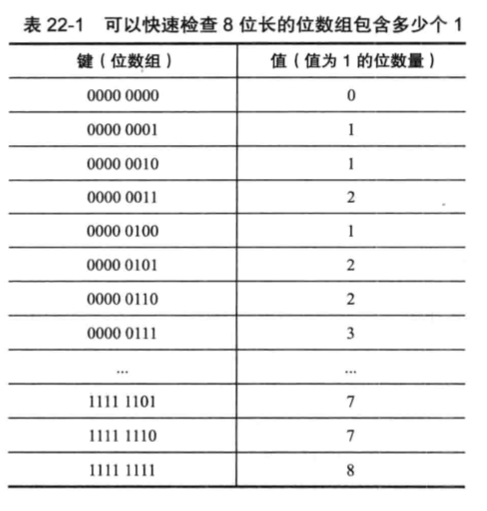
3.二进制位统计算法（3）：variable-precision SWAR算法
“swar函数每次执行可以计算32个二进制位的汉明重量，它比之前介绍的遍历算法要快32倍，比键长为8位的查表法快4倍，比键长为16位的查表法快2倍，并且因为swar函数是单纯的计算操作，所以它无须像查表法那样，使用额外的内存。复杂度为O（N/32）。
“另外，因为swar函数是一个常数复杂度的操作，所以我们可以按照自己的需要，在一次循环中多次执行swar，从而按倍数提升计算汉明重量的效率：
·例如，如果我们在一次循环中调用两次swar函数，那么计算汉明重量的效率就从之前的一次循环计算32位提升到了一次循环计算64位。

#####Redis中BITCOUNT的实现
在执行BITCOUNT命令时，程序会根据未处理的二进制位的数量来决定使用那种算法：
·如果未处理的二进制位的数量大于等于128位，那么程序使用variable-precision SWAR算法来计算二进制位的汉明重量。在variable-precision SWAR算法方面，BITCOUNT命令在每次循环中载入128个二进制位，然后调用四次32位variable-precision SWAR算法来计算这128个二进制位的汉明重量。
·如果未处理的二进制位的数量小于128位，那么程序使用查表算法来计算二进制位的汉明重量。
##### BITOP命令的实现
因为C语言直接支持对字节执行逻辑与（&）、逻辑或（|）、逻辑异或（^）和逻辑非（~）操作，所以BITOP命令的AND、OR、XOR和NOT四个操作都是直接基于这些逻辑操作实现的。
例如：
```
BITOP AND result x y
```
使用BITOP命令对x和y进行与运算，并将结果保存在result键上。
### 第 23 章 慢查询日志
Redis的慢查询日志功能用于记录执行时间超过给定时长的命令请求，用户可以通过这个功能产生的日志来监视和优化查询速度。
服务器配置有两个和慢查询日志相关的选项：
·slowlog-log-slower-than选项指定执行时间超过多少微秒（1秒等于1 000 000微秒）的命令请求会被记录到日志上。
·slowlog-max-len选项指定服务器最多保存多少条慢查询日志。如果满了会将最旧的慢查询日志删除。
### 第 24 章 监视器
通过执行MONITOR命令，客户端可以将自己变为一个监视器，实时地接收并打印出服务器当前处理的命令请求的相关信息。
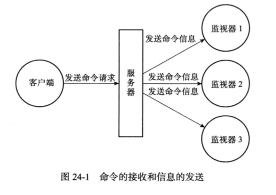
服务器收到MONITOR命令后，会将这个客户端的REDIS_MONITOR标志会被打开，并且这个客户端本身会被添加到monitors链表的表尾，之后服务器在每次处理命令请求之前，都会调用replicationFeedMonitors函数，由这个函数将被处理的命令请求的相关信息发送给各个监视器。
